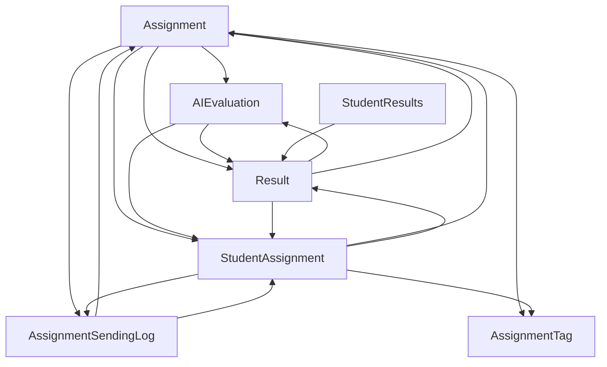
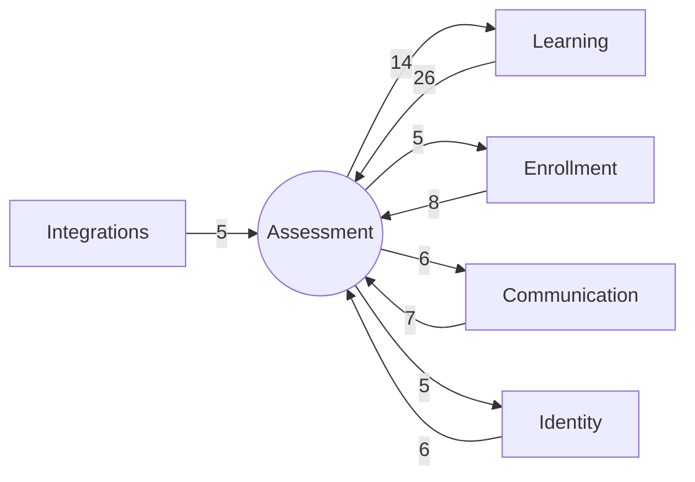

# Bounded Context: Assessment

> **Generated:** 2026-08-29 · **Branch surveyed:** `New-Dummy-Prod-0605`
> **Companion documents:** `documentation/CONTEXT_MAP.md`, `documentation/BOUNDED_CONTEXT_{IDENTITY,LEARNING,ENROLLMENT,COMMUNICATION,INTEGRATIONS}.md`
> Derived from `use Modules\X` imports (377 unique cross-module edges codebase-wide); every module's `requires` in `module.json` is empty, so this is the only real dependency graph that exists.

## 1. Responsibility

Assessment owns the **assignment library, student submissions, evaluator grading, AI-assisted evaluation, scoring, and student-facing results**. It's the most internally cohesive of the 6 contexts — a genuine grading pipeline (`Assignment → StudentAssignment → Result`, with `AIEvaluation` looping through an external service) rather than a loose federation of unrelated modules.

## 2. Modules in this context (7)

| Module | Status | Purpose | Key entities |
|---|---|---|---|
| `Assignment` | Live | Core assignment library, including bootcamp-specific assignments | `Assignment` |
| `AssignmentTag` | Live | Tagging system for assignments (`spatie/laravel-tags`) | `Tag` |
| `AssignmentSendingLog` | Live | Logs of when/how assignments were sent to students | `AssignmentLog`, `AssignmentLogMapping` |
| `StudentAssignment` | Live — hub | Student-side assignment submissions, view/reporting, first-assignment send tracking | `StudentAssignment`, `StudentAssignmentView`, `FirstAssignmentSendLog` |
| `Result` | Live — hub | Student results/scores, exercise scoring, featured assignment mapping | `Result`, `ResultView`, `ResultExerciseScore`, `CourseFeaturedAssignmentMapping`, `StudentResultVideoMapping` |
| `AIEvaluation` | Live | AI-assisted evaluation — syncs course materials to an AI model, logs evaluation runs, dispatches submissions to an external auto-grading API | `AIModels`, `AICourseMaterialSyncs`, `AIEvaluationAuditLogs` |
| `StudentResults` | Live — thin | Student-facing results/scores view | *(entity-less — reads `Result`)* |

## 3. Ubiquitous language

- **Assignment** — the library item (a question/exercise definition), distinct from a **StudentAssignment** (a specific student's instance of it, with submission state).
- **Result** — the graded outcome of a `StudentAssignment`. **Landmine:** `results.assignment_id` is a foreign key to `student_assignments.id`, **not** `assignments.id` — easy to get wrong from column name alone (`DEVELOPER_DOCUMENTATION.md` §9, `DATABASE_SCHEMA.md`).
- **AI Evaluation** — a distinct grading path that submits to an external auto-evaluation API and writes back into `Result`, parallel to (not necessarily replacing) human evaluator grading.

## 4. Internal shape

This is a **near-complete mesh among just 4 modules** (`Assignment`, `AssignmentSendingLog`, `Result`, `StudentAssignment`, plus `AIEvaluation` looping through both) — genuinely one tightly-bound pipeline, not an artificial grouping. `AssignmentTag` and `StudentResults` are the only two with a single direction of coupling (pure dependents).

## 5. Relationships to the other contexts

| Other context | Assessment depends on it | It depends on Assessment | Net direction |
|---|---|---|---|
| Learning | 14 edges | **26 edges** | **Assessment is upstream of Learning** — the catalog and BFF layer (`StudentDashboard`, `StudentMyCourses`, `CourseBatch`, `Topic`, `CourseCompletionMaster`) read grading/result data extensively for display and completion-rule logic; Assessment reads back mainly just `Course`/`Package`/`Topic` for context |
| Enrollment | 5 edges | 8 edges | Assessment is upstream — enrollment reads `Assignment`/`Result`/`StudentAssignment` for reporting |
| Communication | 6 edges | 7 edges | Roughly balanced |
| Identity | 6 edges | 5 edges | Roughly balanced |
| Integrations | 0 edges | 5 edges | Assessment is purely upstream — `AgenticSupportSystem` reads `Assignment`/`Result`/`StudentAssignment` extensively, nothing flows back |

Representative concrete edges:
- `Course -> Assignment/Result/StudentAssignment/AIEvaluation`, `CourseBatch -> Result/StudentAssignment`, `Topic -> Assignment/Result/StudentAssignment` — Learning's catalog reading grading data for progress/completion display
- `AgenticSupportSystem -> Assignment/AssignmentTag/Result/StudentAssignment` — the AI support integration reads the full grading pipeline
- `Assignment -> User` — assignment records reference an admin user (creator/owner), the one direct Identity dependency from this context's core module

## 6. Auth boundary

Admin (`sanctum`) guard covers assignment-library CRUD and evaluator grading. Student (`student`) guard covers submission endpoints and `StudentResults`. `AIEvaluation`'s webhook endpoint (`ai-evaluation.webhook`, `ai-assignments/webhook`) is a third, separate trust boundary — it receives callbacks from the external auto-evaluation service, not from either guard; verify its authentication mechanism before assuming it's protected the same way as the rest of the API.

## 7. Integrations owned by this context

| Integration | Direction | Notes |
|---|---|---|
| **Auto-Evaluation AI API** | Outbound + inbound webhook | `AIEvaluation`'s `Evaluate`/`BulkEvaluateStudentAssignmentJob` submit for grading; results return via `POST /api/v1/ai-evaluation/webhook` and `POST /api/v1/ai-assignments/webhook`. Env: `AUTO_EVALUATION_API_URL` |

## 8. Risks specific to this context

1. **`results.assignment_id` FK points to `student_assignments.id`, not `assignments.id`** — the single most concrete landmine in this context; get it wrong and any direct-DB seeding/verification (e.g. from an external QA test suite) will silently join against the wrong table.
2. **`StudentAssignment` and `Result` are internal hubs** (18/19 system-wide in-degree) — most other contexts read them for dashboards and reporting; treat schema changes here as having Learning-context-wide blast radius, not just local.
3. **Two grading paths exist in parallel** (human evaluator vs. `AIEvaluation`'s external auto-grader) writing into the same `Result` model — confirm with the team how conflicts/precedence between the two are resolved before building test coverage that assumes only one path.
4. **`AgenticSupportSystem` (Integrations context) depends heavily on this context's internals** (5 edges, reading `Assignment`/`Result`/`StudentAssignment` directly) with nothing flowing back — a refactor here can silently break that integration with no local signal.
