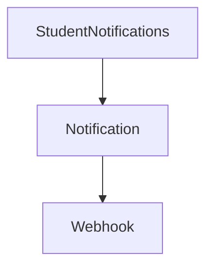
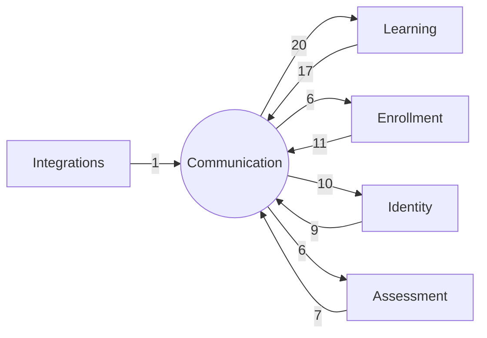

# Bounded Context: Communication

> **Generated:** 2026-08-29 · **Branch surveyed:** `New-Dummy-Prod-0605`
> **Companion documents:** `documentation/CONTEXT_MAP.md`, `documentation/BOUNDED_CONTEXT_{IDENTITY,LEARNING,ENROLLMENT,ASSESSMENT,INTEGRATIONS}.md`
> Derived from `use Modules\X` imports (377 unique cross-module edges codebase-wide); every module's `requires` in `module.json` is empty, so this is the only real dependency graph that exists.

## 1. Responsibility

Communication owns every form of "the system talks to a student or admin about something that happened elsewhere": satisfaction surveys (CSAT, one per subject area), Net Promoter Score surveys, in-app notifications, email templates, and the generic inbound/outbound webhook mechanism. Unlike Assessment, this context is **not** a cohesive pipeline — it's a federation of independent survey/notification features that each individually reach outward into whichever context they're surveying, but rarely talk to each other.

## 2. Modules in this context (9)

| Module | Status | Purpose | Key entities |
|---|---|---|---|
| `AssignmentCSAT` | Live | Post-assignment satisfaction survey forms + reason-code mappings | `AssignmentCSATForm`, `AssignmentCSATFormReasons`, `AssignmentCSATFormReasonsMapping` |
| `EvaluatorCSAT` | Live | Post-evaluation CSAT survey forms for evaluators | `EvaluatorCSATForm`, `EvaluatorCSATFormReason`, `EvaluatorCSATFormReasonMaping` |
| `ClassCSAT` | ⚠️ Deprecated (tied to dead `Class` feature, Learning context) | Post-class CSAT survey forms | `ClassCSATForm`, `ClassCSATFormReason`, `ClassCSATFormReasonMaping` |
| `PerformanceCoachCSAT` | ⚠️ Deprecated (tied to dead `PerformanceCoach` feature, Learning context) | Post-coaching-call CSAT survey forms | `PerformanceCoachCSATForm`, `PerformanceCoachCSATFormReason`, `PerformanceCoachCSATFormReasonMaping` |
| `NPS` | Live | Net Promoter Score survey collection across courses, packages, bootcamps (v1 + v2 schemas) | `NPSForm`, `NPSFormV2`, `NPSFormReason`, `NPSFormReasonMaping`, `NPSFormReasonMapingV2`, `NPSCourseData`, `NPSPackageData`, `NPSBootcampData` |
| `Notification` | Live | In-app notification system: batch sends, per-channel/category notifications, per-course/package targeting, comments | `Notification`, `BatchNotification`, `ChannelNotification`, `CourseNotification`, `PackageNotification`, `NotificationCategory`, `NotificationChannel`, `NotificationTag(s)`, `NotificationUser`, `NotificationComment` |
| `StudentNotifications` | Live — thin | Student-facing notification retrieval | *(entity-less — reads `Notification`)* |
| `EmailTemplate` | Live | Reusable email templates used across notification flows | `EmailTemplate` |
| `Webhook` | Live | Generic inbound webhook receiver + outbound dispatcher, with failure tracking | `Webhook`, `WebhookEvent`, `WebhookLog` |

## 3. Ubiquitous language

- **CSAT** — Customer Satisfaction survey; this codebase has **four independent CSAT implementations** (Assignment, Evaluator, Class, PerformanceCoach), each with its own form/reason-code entity set rather than a shared abstraction.
- **NPS** — Net Promoter Score, with two schema versions (v1 and v2) coexisting.
- **Webhook** here means both directions: inbound receipt (logged) and outbound dispatch (with retry/failure logging) — don't assume it's one or the other without checking the specific route/job.

## 4. Internal shape

Only 2 intra-context edges out of 9 modules:

The four CSAT modules and `NPS` don't import each other at all — each is a fully independent vertical (form + reasons + reporting) that happens to share a naming pattern, not shared code. `EmailTemplate` is also disconnected from the rest of this context internally.

## 5. Relationships to the other contexts

| Other context | Communication depends on it | It depends on Communication | Net direction |
|---|---|---|---|
| Learning | 20 edges | 17 edges | Roughly balanced, Communication slightly more dependent — every CSAT/NPS/Notification module needs to know *which* course/batch/package/class it's attached to |
| Enrollment | 6 edges | **11 edges** | **Enrollment is upstream** — enrollment lifecycle events actively trigger CSAT/NPS/Notification/Webhook dispatch, more than Communication reaches into Enrollment |
| Identity | 10 edges | 9 edges | Balanced — every survey/notification needs to know *who* to send to |
| Assessment | 7 edges | 6 edges | Balanced |
| Integrations | 0 edges | 1 edge | Nearly isolated from Integrations — only `LawSikho -> Webhook` |

Representative concrete edges:
- `AssignmentCSAT/ClassCSAT/EvaluatorCSAT/NPS/Notification/PerformanceCoachCSAT/StudentNotifications -> Student` — every survey/notification module resolves its recipient through Identity
- `Enrollment -> AssignmentCSAT/NPS/Notification/Webhook` — enrollment activation/lifecycle changes are what actually fire most of this context's dispatch logic
- `EmailTemplate -> Role/Student/User` — templates are addressed to either identity type

## 6. Auth boundary

Admin (`sanctum`) guard covers CSAT/NPS form configuration, `Notification`/`EmailTemplate` management, and `Webhook` admin CRUD. Student (`student`) guard covers `StudentNotifications` retrieval and student-facing CSAT/NPS submission endpoints (several of which are actually exposed through `StudentFrontendEnrollment` in the Enrollment context rather than through this context's own student-facing modules — see that document §8).

## 7. Integrations owned by this context

| Integration | Direction | Notes |
|---|---|---|
| **Generic Webhook mechanism** | Both | `Webhook` module: inbound receipt + outbound dispatch/retry with failure logging. Env: `API_KEY` (generic). **Note:** two `webhooks` table migrations exist (`2025_01_07_172031`, `2025_02_19_164706`) — confirm which is authoritative before relying on the schema |

Email delivery itself (Mailgun/Postmark/SES, per `config/mail.php`) is infrastructure, not a domain integration this context "owns" in the same sense — `EmailTemplate` just supplies the content.

## 8. Risks specific to this context

1. **Four parallel, non-shared CSAT implementations.** Any improvement to survey logic (e.g. a new reason-code type) has to be made four times, once per module (`AssignmentCSAT`, `EvaluatorCSAT`, `ClassCSAT`, `PerformanceCoachCSAT`) — there is no shared CSAT base to extend.
2. **Two of the nine modules are dead-feature CSAT forms** (`ClassCSAT`, `PerformanceCoachCSAT`) tied to Learning's deprecated `Class`/`PerformanceCoach` features — safe to deprioritize together as a pair whenever the team removes the parent features, but check for the same "still imported by live code" pattern documented in `BOUNDED_CONTEXT_LEARNING.md` §6 before deleting.
3. **Near-zero internal cohesion** (2 edges across 9 modules) — "Communication" is a documentation-level grouping over otherwise-independent features, not a tightly bound domain the way Assessment is. Don't assume a change to `Notification` has any bearing on `NPS` or the CSAT modules.
4. **`Webhook` is really an infrastructure primitive bundled in here**, not a domain concept — 11 other modules across every context use it as a generic dispatch mechanism, so its coupling profile looks more like a shared-kernel utility than a feature.
5. **NPS v1/v2 schema coexistence** — confirm which version is authoritative for new work before building against either `NPSForm` or `NPSFormV2`.
