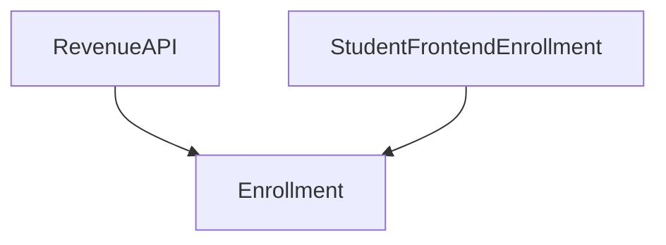
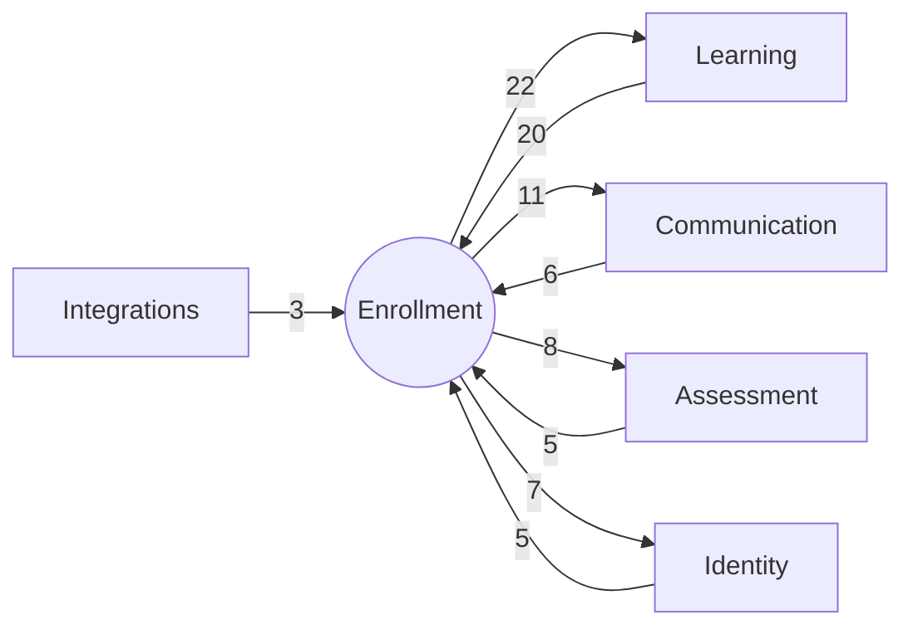

# Bounded Context: Enrollment

> **Generated:** 2026-08-29 · **Branch surveyed:** `New-Dummy-Prod-0605`
> **Companion documents:** `documentation/CONTEXT_MAP.md`, `documentation/BOUNDED_CONTEXT_{IDENTITY,LEARNING,ASSESSMENT,COMMUNICATION,INTEGRATIONS}.md`
> Derived from `use Modules\X` imports (377 unique cross-module edges codebase-wide); every module's `requires` in `module.json` is empty, so this is the only real dependency graph that exists.

## 1. Responsibility

Enrollment owns **the commercial/contractual relationship between a Student and a Course/Package/Bootcamp**: the enrollment record itself, its lifecycle (activate → pause → resume → deactivate), bulk CSV import/export and reporting, referral attribution, and inbound revenue/installment-payment sync from the billing platform. It's the smallest context by module count (4) but its central module, `Enrollment`, is **the single most depended-upon module in the entire codebase** — 39 other modules import its entities.

## 2. Modules in this context (4)

| Module | Status | Purpose | Key entities |
|---|---|---|---|
| `Enrollment` | Live — **system-wide hub** | Core enrollment records, bulk CSV import/export, pause logs, enrollment questionnaires | `Enrollment`, `BulkEnrollmentDetail`, `BulkEnrollmentReport`, `EnrollmentCSVReport`, `CsvExportTemplate`, `EnrollmentPauseLogNew`, `EnrollmentQuestion`, `EnrollmentQuestionAnswer` |
| `RevenueAPI` | Live — inbound integration | Receives enrollment/installment-payment data pushed from LawSikho's revenue/billing platform | *(entity-less — writes directly into `Enrollment`)* |
| `StudentFrontendEnrollment` | Live — but see §8 | Student-facing enrollment frontend; **also hosts several CSAT/NPS/Notification/Task/Filter controllers**, behaving like a general student-portal aggregation layer rather than an enrollment-specific one | *(entity-less)* |
| `ReferralSystem` | Live | Student referral program | *(entity-less — likely stores on `Student`/`Enrollment` directly)* |

## 3. Ubiquitous language

- **Enrollment** — the row linking one Student to one Course/Package/Bootcamp offering, with a lifecycle state (active/paused/deactivated).
- **Bulk enrollment** — CSV-driven mass enrollment import, with its own report/summary entities.
- **Enrollment pause** — a distinct logged event (`EnrollmentPauseLogNew`), not just a status flag.

## 4. Internal shape

Only 2 intra-context edges — this context is nearly a star with `Enrollment` at the center:

`ReferralSystem` doesn't even import `Enrollment` directly — its only cross-module imports are `Student`/`StudentProfile` (Identity context), meaning it likely writes referral data onto the student record rather than the enrollment record.

## 5. Relationships to the other contexts

| Other context | Enrollment depends on it | It depends on Enrollment | Net direction |
|---|---|---|---|
| Learning | 22 edges | 20 edges | **Near-symmetric cycle** — see full discussion in `BOUNDED_CONTEXT_LEARNING.md` §5. Course/Batch/Package/Bootcamp and Enrollment are mutually dependent |
| Communication | 11 edges | 6 edges | Enrollment is upstream — enrollment lifecycle events trigger CSAT/NPS/Notification/Webhook dispatch |
| Assessment | 8 edges | 5 edges | Enrollment is mildly upstream |
| Identity | 7 edges | 5 edges | Roughly balanced |
| Integrations | 1 edge | 3 edges | Enrollment is mostly upstream — `AgenticSupportSystem`/`AtsAPI`/`LawSikho` read enrollment data; only `StudentFrontendEnrollment -> AtsAPI` reaches out |

Representative concrete edges:
- `Enrollment -> Course/CourseBatch/Bootcamp/Package/CourseCriteria/CourseCategoryCriteria/CourseCompletionMaster/ProjectManagement/StudentDashboardManagement/BookMaster/BookDeliveryLog` — Enrollment reaching deep into Learning, including 2 of Learning's deprecated modules (`BookMaster`, `ProjectManagement`) directly from `Enrollment.php` (see `CONTEXT_MAP.md` §5 for file:line evidence)
- `Enrollment -> AssignmentCSAT/NPS/Notification/Webhook` — enrollment lifecycle triggers survey/notification dispatch
- `RevenueAPI -> Student` — the inbound revenue integration also touches Identity directly, not just Enrollment

## 6. Auth boundary

`Enrollment` itself is admin-guarded (`sanctum`) CRUD + bulk import/export. `StudentFrontendEnrollment` sits behind the `student` guard — it's the student-facing half of this context.

## 7. Integrations owned by this context

| Integration | Direction | Notes |
|---|---|---|
| **Revenue/Billing platform** | **Inbound** (the only major integration in the whole system where this API is the *receiver*, not the initiator) | `RevenueAPI` controller + `ProcessInstallmentPaymentJob`; env vars `MAIN_APP_API_KEY`/`MAIN_APP_API_SECRET`/`MAIN_APP_URL` |
| **Zoho Desk** | Outbound (pull) | `Enrollment::SyncZohoSupportResponses` console command pulls support ticket responses into enrollment records; `students.zoho_contact_id` column |
| **Edmingle (LMS)** | Outbound | `CreateEdmingleBatch`/`RetryEdmingleAssignmentJob` — enrollment activation/deactivation triggers Edmingle batch add/remove (shared with Learning context, see that document) |

## 8. Risks specific to this context

1. **`Enrollment` is the system-wide shared kernel — the single highest-blast-radius module in the codebase** (39 dependents). Any schema or behavior change here should be assumed to ripple into all 5 other contexts, not just this one.
2. **Cyclic coupling with Learning** (§5) — don't treat Enrollment as cleanly "below" or "above" the course catalog; they must be reasoned about together.
3. **`StudentFrontendEnrollment`'s scope has drifted beyond enrollment.** Its 25 outgoing edges touch CSAT, NPS, Notification, ProjectManagement, and Learning's entire BFF layer (`StudentDashboard`, `StudentMyCourses`) — confirm with the team whether this is an intentional "student portal" aggregator that outgrew its name, or accidental duplication of logic that also exists in Learning's dedicated BFF modules (`DEVELOPER_DOCUMENTATION.md` §4 flags the same concern).
4. **`RevenueAPI` and `ReferralSystem` are both entity-less** — verify where their data actually lands (most likely directly on `Enrollment`/`Student` columns) before assuming there's a dedicated table to query for either concept.
5. **Two `webhooks` table migrations exist** (`2025_01_07_172031` and `2025_02_19_164706`) — relevant if you're tracing enrollment-triggered webhook dispatch; confirm which is authoritative before building tests against it (`DEVELOPER_DOCUMENTATION.md` §9).
