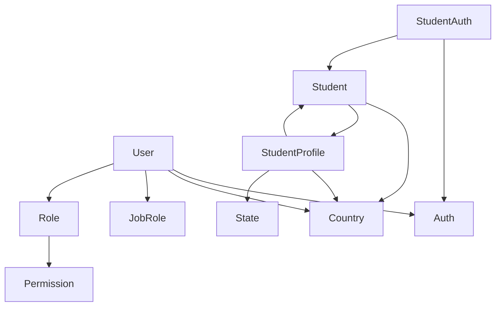
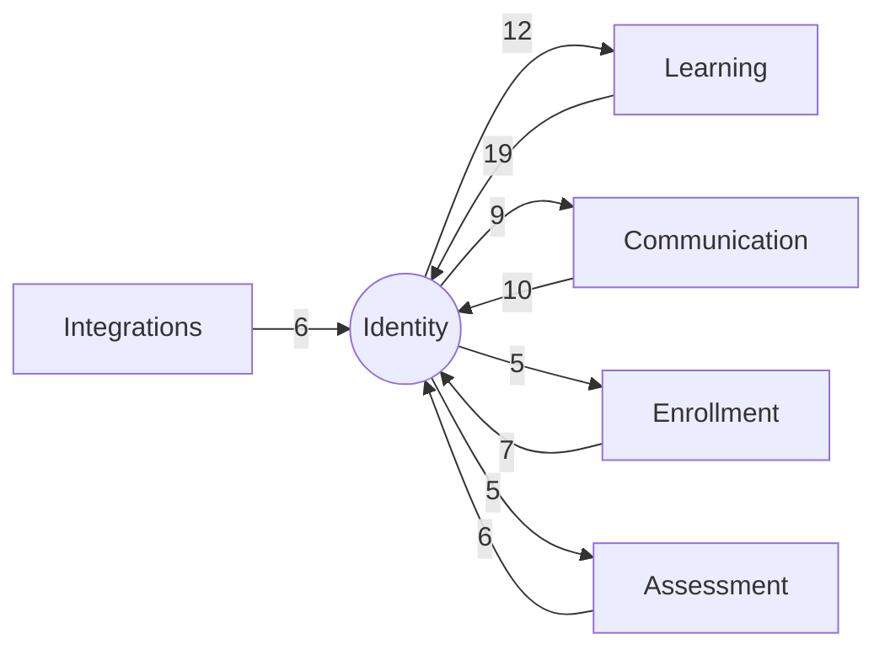

# Bounded Context: Identity

> **Generated:** 2026-08-29 · **Branch surveyed:** `New-Dummy-Prod-0605`
> **Companion documents:** `documentation/CONTEXT_MAP.md` (system-wide module coupling), `documentation/BOUNDED_CONTEXT_{LEARNING,ENROLLMENT,ASSESSMENT,COMMUNICATION,INTEGRATIONS}.md` (the other five contexts)
> This document partitions the 62 `Modules/*` into 6 bounded contexts — a different, coarser cut than `CONTEXT_MAP.md`'s 11 organizational groups. Where the two disagree on where a module "belongs," that's intentional: this cut is optimized for describing business-capability ownership, not code proximity. Derived from `use Modules\X` imports (the only real dependency signal in this codebase — every `module.json`'s `requires` array is empty).

## 1. Responsibility

Identity owns **who is allowed into the system and who they are** — two entirely separate person-models with two separate Sanctum guards (admin/staff vs student), the RBAC layer gating the admin side, and the demographic/profile data attached to each identity. Every other context treats Identity as ground truth for "which student" or "which staff member" a record belongs to.

## 2. Modules in this context (13)

| Module | Status | Purpose | Key entities |
|---|---|---|---|
| `Auth` | Live | Admin/staff authentication — Sanctum login/logout, registration, password reset, email verification | *(thin controller layer over `App\Models\User`, no dedicated entity)* |
| `StudentAuth` | Live | Student authentication — login, OTP verification, password reset, SSO endpoints (admin-initiated + Edmingle-initiated) | *(thin controller layer over `Student`)* |
| `User` | Live | Admin/staff user records, user-to-job-role mapping | `UserDetail`, `UserJobRoleMapping` |
| `Role` | Live | Role master data + model-role pivot (`spatie/laravel-permission`) | `Role`, `ModelHasRole` |
| `Permission` | Live | Permission master data (`spatie/laravel-permission`) | `Permission` |
| `JobRole` | Live | Job role master data (consumed by `AtsAPI` and `User`) | `JobRole` |
| `Student` | Live | **The core student aggregate root** — profile, availability, misc detail | `Student`, `StudentOtherDetail`, `StudentWeekDayAvailability` |
| `StudentProfile` | Live | Extended profile, original registration snapshot, "how did you hear about LawSikho" survey | `KnowAboutLawsikhoQuestion`, `KnowAboutLawsikhoStudentAnswer`, `StudentOriginalRegistrationDetails` |
| `StudentDegree` | Live | Student academic degree records | *(entity-less — likely written onto `Student` directly)* |
| `StudentUniversity` | Live | Student university/education background | *(entity-less)* |
| `Country` | Live | Country reference/master data | `Country` |
| `State` | Live | State/province reference/master data | `State` |
| `InternalNotes` | Live | Internal staff notes on students, with edit history | `InternalNotesHistory`, `StudentInternalNotes` |

Note: the base authenticatable admin model, `App\Models\User`, lives in `app/`, not `Modules/User` — the module only adds the admin-side extension data (`UserDetail`, job-role mapping). This is the one place in the codebase where the "identity" for a guard isn't fully contained inside its own module.

**No dedicated bounded context exists for "the deprecated cluster" here** — unlike Learning, Identity has zero deprecated modules. Every module in this context is confirmed live.

## 3. Ubiquitous language

- **Admin/Staff** — `App\Models\User`, guard `sanctum`, gated by `spatie/laravel-permission` roles.
- **Student** — `Modules\Student\Entities\Student`, guard `student`, no permission layer.
- **Guard** — Laravel's auth-driver concept; this app never mixes the two.
- **Sanctum Personal Access Token** — never expires by default (`config/sanctum.php`) unless revoked.

## 4. Internal shape

Two loosely-connected stars: `User` (admin identity) and `Student`/`StudentProfile` (student identity), joined only by `StudentAuth -> Auth` — a code-level reuse of the admin auth controller pattern, not a data relationship.

## 5. Relationships to the other contexts

| Other context | Identity depends on it | It depends on Identity | Net direction |
|---|---|---|---|
| Learning | 12 edges | 19 edges | **Identity is upstream of Learning** — Learning reads Student/Role/User far more than Identity reads course data |
| Communication | 9 edges | 10 edges | Roughly balanced — Communication needs to know *who* to notify/survey |
| Enrollment | 5 edges | 7 edges | Identity is mildly upstream |
| Assessment | 5 edges | 6 edges | Identity is mildly upstream |
| Integrations | 0 edges | 6 edges | Identity is purely upstream — `AgenticSupportSystem`/`LawSikho` read `Student`/`Country`, Identity never reaches into Integrations |

Representative concrete edges (not exhaustive — see `CONTEXT_MAP.md` appendix for the full 377-edge list):
- `Student -> Course/CourseBatch/Package/PerformanceCoach/ProjectManagement/Topic` (Identity → Learning)
- `Role -> Course/Enrollment/EmailTemplate` (Identity → other contexts — role-based gating touches almost everything)
- `Student.php` directly declares Eloquent relationships into `ClassParticipants`, `ClassCSATForm`, four `PerformanceCoach*` entities, and `ProjectTaskStudentFiles` — all from Learning's **deprecated** sub-cluster (see `CONTEXT_MAP.md` §5 for exact file:line citations). **This is the most important fact in this whole document**: the identity aggregate root is not free of dead-feature coupling just because Identity itself has no deprecated modules.

## 6. Auth boundary

Identity **defines** the two guards every other context's routes sit behind:

| Guard | Model | Used by |
|---|---|---|
| `sanctum` (admin) | `App\Models\User` | Every admin-side route across all 6 contexts |
| `student` | `Modules\Student\Entities\Student` | Every student-facing route (Learning's BFF layer, Assessment's submission endpoints, etc.) |

`spatie/laravel-permission` RBAC covers only the admin guard. The student guard has **no** role/permission layer — any student-side authorization logic is hand-rolled per-controller, not framework-enforced. `tymon/jwt-auth` is an installed-but-unused dependency; don't assume JWT plays any role in this boundary (see `DEVELOPER_DOCUMENTATION.md` §5).

## 7. Integrations owned by this context

- **Firebase Cloud Messaging (FCM)** — push-token registration jobs live in `User`/`Student` (`SendUserSubscriberTokenToFCM`, `SendStudentSubscriberTokenToFCM`). Full integration detail: `DEVELOPER_DOCUMENTATION.md` §14.
- **Employer/ATS registration side-effect** — triggered from `Modules/User/Http/Controllers/UserController.php`, but the actual gateway logic belongs to the Integrations context (`AtsAPI`) — see that document.

No other external system is Identity's to own; Edmingle SSO, despite touching `Student`, is orchestrated from `StudentAuth`'s controller but the sync jobs live in Enrollment/Learning contexts.

## 8. Risks specific to this context

1. **No shared "person" concept.** An admin and a student are unrelated rows in unrelated tables with unrelated auth flows — if the same human is ever both, the system has no way to know it.
2. **`Student` is a de facto shared kernel.** 33 modules across every other context depend on it (system-wide 2nd-highest in-degree, per `CONTEXT_MAP.md` §4) — any migration touching the `students` table should be assumed to ripple everywhere, not just within this context.
3. **Dead-feature coupling baked into the core model.** `Student.php` and (in the Enrollment context) `Enrollment.php` declare direct relationships into 5 of Learning's 10 deprecated modules — you cannot delete those Learning modules by folder-removal alone. See `CONTEXT_MAP.md` §5.
4. **RBAC asymmetry.** Only the admin guard is permission-aware; don't assume student-side endpoints have the same authorization rigor without checking the controller.
