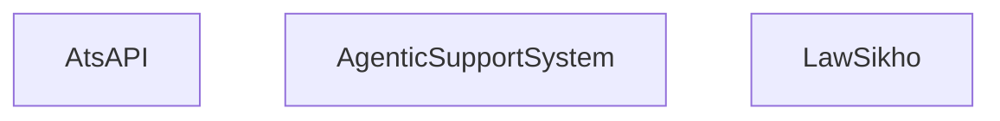
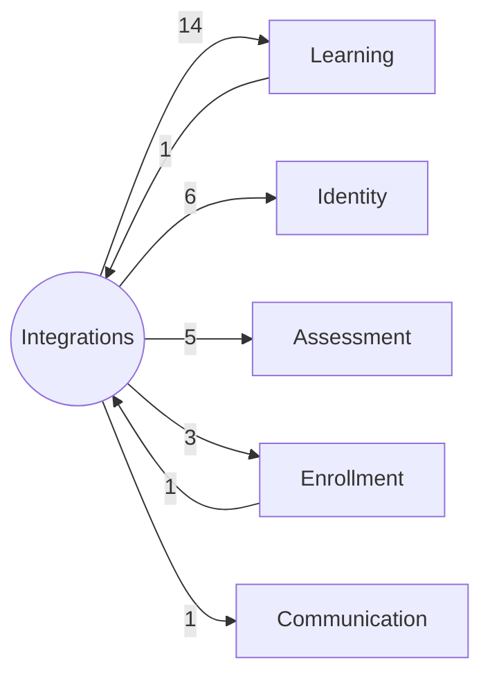

# Bounded Context: Integrations

> **Generated:** 2026-08-29 · **Branch surveyed:** `New-Dummy-Prod-0605`
> **Companion documents:** `documentation/CONTEXT_MAP.md`, `documentation/BOUNDED_CONTEXT_{IDENTITY,LEARNING,ENROLLMENT,ASSESSMENT,COMMUNICATION}.md`
> Derived from `use Modules\X` imports (377 unique cross-module edges codebase-wide); every module's `requires` in `module.json` is empty, so this is the only real dependency graph that exists.

## 1. Responsibility

Integrations owns the modules whose **entire reason to exist is bridging to an external system**, and which don't have a more specific domain home elsewhere. This context does **not** own every external integration in the codebase — most are embedded directly in whichever domain context they serve (Edmingle sync lives in Learning/Enrollment/Identity, the Auto-Evaluation API lives in Assessment, the Meeting API lives in Learning's `StudentBookACall`, FCM lives in Identity, Zoho Desk lives in Enrollment). What's filed here instead are the modules that are *purely* gateway/adapter code: `AtsAPI`, `AgenticSupportSystem`, and the catch-all `LawSikho` module.

## 2. Modules in this context (3)

| Module | Status | Purpose | Key entities |
|---|---|---|---|
| `AtsAPI` | Live | Integration with an external Applicant Tracking System — maps courses to job postings | `CourseJobMapping` |
| `AgenticSupportSystem` | Live | Backend for an AI-driven support/agent system; likely wraps an external agentic API (see `AGENTIC_API_V2_CURL_REFERENCE.md` at repo root — a root-level doc, treat as possibly stale per this project's general caveat) | *(entity-less)* |
| `LawSikho` | Live — ambiguous scope | Catch-all/legacy integration; logs third-party API calls | `ThirdPartyLog` |

**Genuinely ambiguous from names alone** (flagged in `DEVELOPER_DOCUMENTATION.md` §4 and worth re-confirming with the team before extending): the exact intended scope of `LawSikho` — it reads as a grab-bag rather than a bounded responsibility.

## 3. Ubiquitous language

- **Static token auth** — both `AgenticSupportSystem` (`StaticTokenAuth`, `ListingStaticTokenAuth` middleware) and `LawSikho` (`CheckLawSikhoApiToken` middleware) use a shared-secret bearer token pattern instead of Sanctum — a different trust model from the rest of the API.
- **`AtsGateWay`** — a middleware registered by `AtsAPIServiceProvider` (aliased `ats.gateway`) but **not attached to any live route** (confirmed 2026-08-29) — its channel-based proxy logic, including a real double-processing bug for non-`Lawsikho`/`SkillArbitrage` channels, does not currently execute in production. Don't build regression tests expecting to reproduce it.

## 4. Internal shape

Zero intra-context edges — the three modules are entirely independent of each other:

Each reaches outward into the domain contexts independently; none of them collaborate with each other.

## 5. Relationships to the other contexts

| Other context | Integrations depends on it | It depends on Integrations | Net direction |
|---|---|---|---|
| Learning | **14 edges** | 1 edge | Integrations is almost purely downstream (a *consumer*) of Learning |
| Identity | 6 edges | 0 edges | Integrations is purely downstream of Identity |
| Assessment | 5 edges | 0 edges | Integrations is purely downstream of Assessment |
| Enrollment | 3 edges | 1 edge | Nearly purely downstream |
| Communication | 1 edge | 0 edges | Nearly isolated |

**This is the cleanest coupling shape of any of the 6 contexts.** 29 outbound edges vs. only 2 inbound (`StudentDashboard -> LawSikho`, `StudentFrontendEnrollment -> AtsAPI`) — the textbook shape of an outbound gateway/anti-corruption layer. Unlike the Enrollment↔Learning cycle documented elsewhere, nothing meaningfully depends on this context, so it can be refactored internally with low external risk.

**The flip side:** because almost nothing points back to Integrations, a breaking change in Learning/Assessment/Identity has **no local signal** warning you it broke an integration — `AgenticSupportSystem` alone reaches into `Assignment`, `AssignmentTag`, `Bootcamp`, `Country`, `Course`, `CourseBatch`, `CourseCategory`, `CourseCategoryCriteria`, `CourseCriteria`, `Enrollment`, `Package`, `Result`, `Student`, `StudentAssignment`, `StudentProfile`, `Topic`, and `BookDeliveryLog` — 17 modules across 4 other contexts — with zero modules depending back on it to catch a regression.

## 6. Auth boundary

None of the three modules use the standard `sanctum`/`student` guards. Both `AgenticSupportSystem` and `LawSikho` gate access with static shared-secret bearer tokens validated by module-local middleware (not registered in `app/Http/Kernel.php`, applied directly in each module's route files). `AtsAPI`'s intended gateway middleware (`AtsGateWay`) exists but is unwired (§3) — its one live route (`save-job-and-course-mapping`) carries only the generic `json.response` middleware, i.e. **no dedicated auth check found on that route** beyond whatever's implied by `json.response`. Verify this directly before assuming any endpoint here is protected the way admin/student routes are.

## 7. External systems this context bridges to

| Integration | Purpose | Auth model | Key env vars |
|---|---|---|---|
| **ATS / Job Portal + Employer microservice** | Course-to-job-posting mapping; a `User`-side side effect (Identity context) also registers staff on an external job-portal API and then an employer microservice | Unclear/unwired (see §5–6) | `ATS_API_BASE_URL`, `ATS_API_KEY`, `ATS_API_SECRET`, `ATS_API_URL`, `EMPLOYER_SERVICE_API_URL` |
| **Agentic Support System API** | AI-driven support/chat backend | Static bearer token (`X-API-Token` or `Authorization` header) | `AGENTIC_SUPPORT_SYSTEM_TOKEN`, `AGENTIC_SUPPORT_SYSTEM_LISTING_TOKEN`, `AGENTIC_USER_ID` |
| **LawSikho catch-all** | Logs third-party API calls (`ThirdPartyLog`); also the entry point for bootcamp creation (`POST /v1/bootcamp_from_lawsikho`, writing into Learning's `Bootcamp`) | Shared-secret header (`X-Auth-Token` via `CheckLawSikhoApiToken`) | `lawsikho.api_token` (config) |

## 8. Risks specific to this context

1. **`LawSikho`'s scope is genuinely unclear.** Before adding anything new to it, confirm with the team what it's actually meant to own — "catch-all/legacy" is not a design, it's an accumulation.
2. **Non-standard auth models.** Neither module uses Sanctum; a test suite or QA harness built assuming uniform `sanctum`/`student` auth across the API will need special-case handling for these two.
3. **`AgenticSupportSystem` has the 2nd-highest raw out-degree in the entire system (17)** while having zero modules depend back on it — the widest "silent breakage" surface in the codebase (§5). Treat any change to `Assignment`, `Result`, `StudentAssignment`, `Course`, `CourseBatch`, `Enrollment`, or `Student` as a reason to specifically re-test this integration, since nothing else will flag the regression for you.
4. **`AtsGateWay` middleware is dead code with a live bug inside it** (double-processing for non-`Lawsikho`/`SkillArbitrage` channels) — confirmed unreachable today, but if a future route ever gets this middleware attached, the bug activates immediately. Worth fixing or removing rather than leaving as a landmine.
5. **A hardcoded secret-shaped fallback** exists in `config/services.php` for `EXTERNAL_PORTAL_UPDATE_API_KEY` (a real-looking API key committed as an `env()` default) — relevant to this context's Course Calendar-adjacent config; should be rotated and removed from source (`DEVELOPER_DOCUMENTATION.md` §9).
