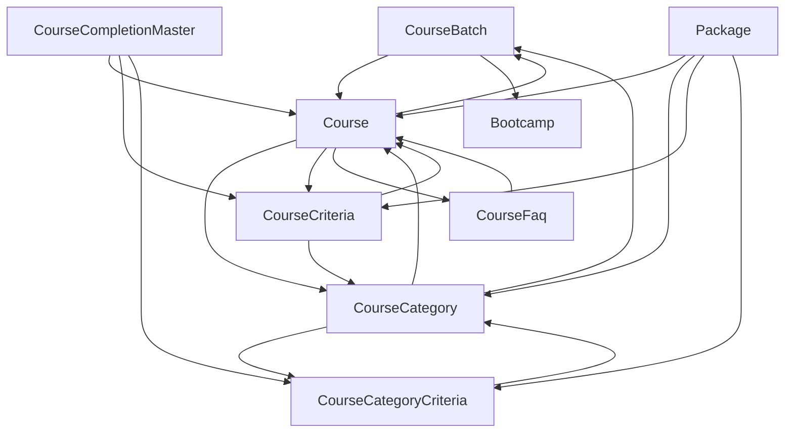
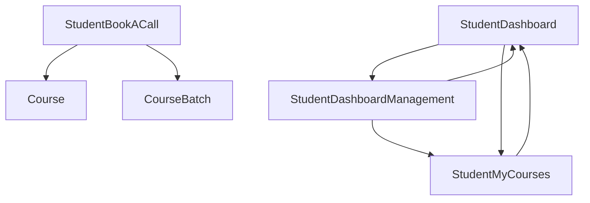
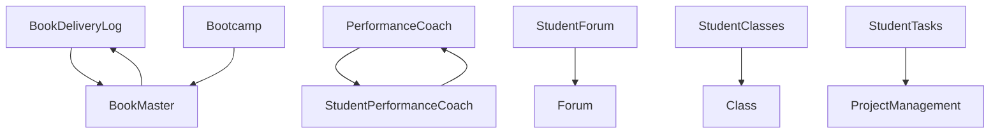
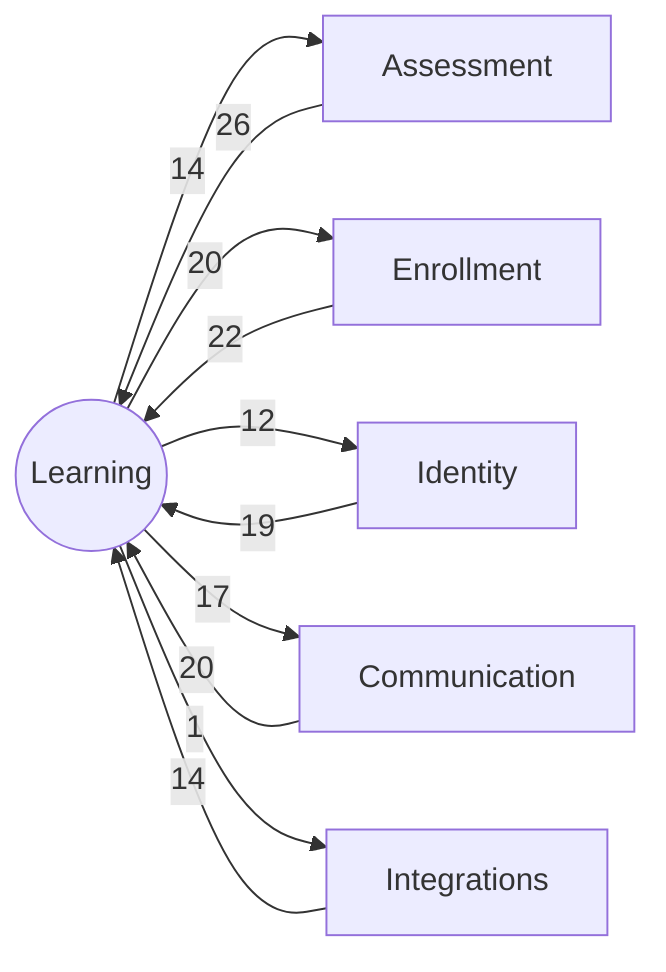

# Bounded Context: Learning

> **Generated:** 2026-08-29 · **Branch surveyed:** `New-Dummy-Prod-0605`
> **Companion documents:** `documentation/CONTEXT_MAP.md`, `documentation/BOUNDED_CONTEXT_{IDENTITY,ENROLLMENT,ASSESSMENT,COMMUNICATION,INTEGRATIONS}.md`
> Derived from `use Modules\X` imports (377 unique cross-module edges codebase-wide); every module's `requires` in `module.json` is empty, so this is the only real dependency graph that exists.

## 1. Responsibility

Learning owns the **curriculum/catalog** (courses, batches, categories, eligibility criteria, topics, packages, bootcamps), the **delivery mechanisms** historically built on top of it (live classes, physical/digital book delivery, performance coaching — the last three now confirmed dead), the **student-facing journey/dashboard aggregation layer**, and student-support surfaces (forum, project/task management — also dead). At 26 modules it's the largest of the 6 contexts, and — by coupling volume — the most tangled.

**Read this context as three sub-clusters bundled under one label, not one cohesive thing** — that's what the code actually shows:

- **(a) Core catalog** — live, central, heavily depended upon by every other context.
- **(b) Student journey / BFF layer** — live, aggregates catalog + enrollment + assessment data for the student portal.
- **(c) Deprecated delivery/support cluster** — 10 of the 26 modules, confirmed off the live product surface but still structurally wired into live code (see §6).

## 2. Modules in this context (26)

### (a) Core catalog — live

| Module | Purpose | Key entities |
|---|---|---|
| `Course` | Course catalog, mentor/instructor/evaluator mappings, mock question/answer bank | `Course`, `CourseMentorMapping`, `CourseInstructorMapping`, `CourseEvaluatorMapping`, `MockQuestion`, `MockAnswer` |
| `CourseBatch` | Batch (cohort) management, Edmingle batch sync, calendar webhook receiver | `CourseBatch`, `EdmingleBatch` |
| `CourseCategory` | Course category master data | `CourseCategory` |
| `CourseCategoryCriteria` | Eligibility rules tied to categories | `CourseCategoryCriteria` |
| `CourseCriteria` | Course/bootcamp-course eligibility criteria | `CourseCriteria` |
| `CourseFaq` | Per-course FAQ content | `CourseFaq` |
| `CoursePlanType` | Course plan/pricing type master data | `CoursePlanType` |
| `CourseCompletionMaster` | Course completion rule config | *(entity-less — reads/writes via other modules)* |
| `Topic` | Curriculum topic management, topic documents, assignment-video mapping | `Topic`, `TopicDocDetail`, `StudentAssignmentVideoMapping` |
| `Package` | Bundled multi-course package catalog | `Package`, `PackageCourseMapping` |
| `Bootcamp` | Bootcamp (bundled course) management, book associations | `Bootcamp`, `BootcampBook` |
| `Evaluator` | Evaluator (grader) master records | `Evaluator` |

### (b) Student journey / BFF layer — live

| Module | Purpose | Key entities |
|---|---|---|
| `StudentDashboard` | Student dashboard/LMS landing data aggregation | *(entity-less — pure aggregator)* |
| `StudentDashboardManagement` | Admin management of the student "journey" steps shown on the dashboard | `StudentDashboardJourneyStep`, `StudentDashboardJourneyStepsMapping`, `StudentDashboardJourneyComment` |
| `StudentMyCourses` | Student's enrolled-course listing, global search | *(entity-less)* |
| `StudentBookACall` | ✅ **Confirmed live** (not to be confused with the dead `PerformanceCoach` pair). Instructor/team call-booking, integrates with a *separate sub-project's own API* | `Team`, `DefaultTeam`, `BookACallMeeting`, `BookACallUserAvailability`, `BookACallUserEvent` |

### (c) Deprecated delivery/support cluster — confirmed not in active use (team, 2026-08-29)

| Module | Purpose | Key entities |
|---|---|---|
| `Class` | Live class scheduling: occurrences, hosts, experts, participants, Zoom mapping | `Classes`, `ClassHost`, `ClassExpert`, `ClassParticipants`, `ClassOccurranceDate`, `ClassPackage`, `ClassCourseBatch`, `ClassCourseMapping`, `ClassTopicAndType`, `ZoomUsers` |
| `StudentClasses` | Student-facing class listing/access | *(entity-less; also has a stray `Untitled-1.sql` in `Routes/` — accidental commit)* |
| `Forum` | Admin-side forum/discussion — proxies to Vanilla Forum | *(entity-less)* |
| `StudentForum` | Student-facing forum access | *(entity-less)* |
| `ProjectManagement` | Kanboard-integrated project/task tracking for student projects | `Project`, `ProjectCategory`, `ProjectMentor`, `ProjectTaskStudentFiles` |
| `StudentTasks` | Student task management with file mapping | `StudentTaskFileMapping` |
| `PerformanceCoach` | Coach categories, call scheduling/slots, outcomes, student-coach assignment | `PerformanceCoachCategory`, `PerformanceCoachCallSchedule`, `PerformanceCoachCallScheduleSlots`, `PerformanceCoachCallOutcome`, `PerformanceCoachStudents`, `PerformanceCoachRange`, `PerformanceCoachSlot`, `PerformanceCoachStartAndPause`, `PerformanceCoachStudentReport`, `PerformanceCoachBlockSlot`, `PerformanceCoachSuspendedCategory` |
| `StudentPerformanceCoach` | Student-facing coaching data | *(entity-less)* |
| `BookMaster` | Master book catalog, course mapping | `Book`, `CourseBook`, `BookDeliveryLog` (shared entity) |
| `BookDeliveryLog` | Physical/digital book delivery tracking | `BookDeliveryLog` |

## 3. Ubiquitous language

- **Course** vs **Bootcamp** vs **Package** — three distinct catalog concepts: a bootcamp's `bootcamps` rows are created via `LawSikho`'s `POST /v1/bootcamp_from_lawsikho`, not `Modules/Course`; don't confuse "bootcamp" (the row) with "bootcamp course" (a `courses` row with `course_type = BOOTCAMP_COURSE`).
- **Batch** — a cohort of a course, synced to Edmingle.
- **Journey step** — the admin-configured dashboard milestones shown to a student (`StudentDashboardManagement`).

## 4. Internal shape

77 intra-context edges exist — too many for one readable diagram, so shown split by sub-cluster.

**Core catalog (a):**

**Student journey / BFF (b):**

**Deprecated cluster (c) — internally cross-wired, not isolated:**

Note `Bootcamp` (live, core catalog) importing `BookMaster` (dead) — one of several places the "live" and "dead" sub-clusters interpenetrate.

## 5. Relationships to the other contexts

| Other context | Learning depends on it | It depends on Learning | Net direction |
|---|---|---|---|
| Assessment | 14 edges | **26 edges** | Assessment is upstream of Learning — the BFF layer (`StudentDashboard`, `StudentMyCourses`) and catalog modules read grading/result data far more than Assessment reads catalog data |
| Enrollment | 20 edges | 22 edges | **Near-symmetric — a real cycle, not a layering.** Neither context can be called cleanly upstream of the other |
| Identity | 19 edges | 12 edges | Learning is downstream of Identity (reads `Student`/`Role`/`User` heavily) |
| Communication | 17 edges | 20 edges | Roughly balanced, Communication slightly more dependent (surveys/notifications need to know *what* course/batch/package to attach to) |
| Integrations | 1 edge | 14 edges | Learning is almost purely upstream — `AgenticSupportSystem`/`AtsAPI`/`LawSikho` read catalog data extensively; only `StudentDashboard -> LawSikho` reaches back |

**The Enrollment ↔ Learning cycle is the single most important structural finding in this document.** 22 edges flow Enrollment→Learning and 20 flow Learning→Enrollment — almost perfectly symmetric. In a cleanly layered system one of these would be near-zero. In practice: `Enrollment.php` imports `Course`, `CourseBatch`, `Bootcamp`, `Package`, `BookMaster`, `CourseCompletionMaster`, `ProjectManagement`, `StudentDashboardManagement`; and in the other direction, `Course.php` imports `Enrollment`, and most of Learning's BFF/catalog modules (`Bootcamp`, `Class`, `CourseCategory`, `Evaluator`, `PerformanceCoach`, `StudentBookACall`, `StudentClasses`, `StudentDashboard*`, `StudentMyCourses`, `StudentTasks`) import `Enrollment` back. Treat "Course catalog" and "Enrollment" as one tightly-coupled unit for change-impact purposes, regardless of which document they're filed under.

## 6. The deprecated cluster is not isolated — cross-reference

10 of this context's 26 modules (`Class`, `ClassCSAT` — filed under Communication —, `StudentClasses`, `Forum`, `StudentForum`, `ProjectManagement`, `StudentTasks`, `PerformanceCoach`, `StudentPerformanceCoach`, `BookMaster`, `BookDeliveryLog`) are confirmed off the live product surface (team, 2026-08-29). But the **live** `Student` and `Enrollment` aggregate roots (Identity and Enrollment contexts respectively) declare direct Eloquent relationships into 5 of them:

- `Student.php` → `ClassParticipants`, `ClassCSATForm`, four `PerformanceCoach*` entities, `ProjectTaskStudentFiles`, `BookDeliveryLog`
- `Enrollment.php` → `Book` (BookMaster), `Project`/`kanboardTrait` (ProjectManagement)

Full file:line citations in `CONTEXT_MAP.md` §5. **Do not delete any of these 10 modules by removing their folder** — grep the whole codebase for `Modules\<Name>\` first, not just this module's own directory.

## 7. Auth boundary

Both guards touch this context: admin (`sanctum`) for catalog CRUD, `student` guard for the journey/BFF layer (`StudentDashboard`, `StudentMyCourses`, `StudentBookACall`) and for the deprecated student-facing modules (still routed, just unused in product).

## 8. Integrations owned by this context

- **Edmingle (LMS)** — batch sync lives here (`CourseBatch`'s `EdmingleBatch` entity, `edmingle_id`/`curriculum_id` columns on `Course`), though the actual sync *jobs* are filed under Enrollment (`CreateEdmingleBatch`) and Identity (`SyncUserWithLMS`) — this integration spans contexts.
- **Course Calendar API** — batch/class scheduling sync (`CourseBatch`'s calendar webhook receiver).
- **Meeting/Book-a-Call API** — `StudentBookACall`'s dedicated external sub-project integration (`MEETING_API_BASE_URL`, `BOOK_A_CALL_API`).
- **Vanilla Forum** and **Kanboard** — both integrations exist only to serve the deprecated `Forum`/`StudentForum` and `ProjectManagement`/`StudentTasks` modules respectively; not worth new investment.
- **Zoom** — `config/zoom.php`, used by the deprecated `Class` module for video meetings.

## 9. Risks specific to this context

1. **Cyclic coupling with Enrollment** (§5) — the two contexts should be evaluated together for any significant refactor; neither is safely "upstream."
2. **38% dead code by module count**, several of which are directly wired into the live `Student`/`Enrollment` aggregate roots (§6) — the biggest single source of "looks deletable, isn't" risk in the whole codebase.
3. **`Course` (32 in / 18 out) and `CourseBatch` (20/11) are shared-kernel hubs** even within this context — same caution as `CONTEXT_MAP.md` §4: schema changes ripple system-wide, not just within Learning.
4. **`StudentDashboard`/`StudentMyCourses` are BFF aggregators with high fan-out, low fan-in** — safe to refactor their *internals* without rippling outward, but they're consuming a lot of surface area from every other context, so any breaking change elsewhere is likely to surface here first.
5. **`Bootcamp` has no create action of its own** — rows are created via `LawSikho`'s `POST /v1/bootcamp_from_lawsikho` (Integrations context) — a cross-context write path that's easy to miss if you only read this module in isolation.
