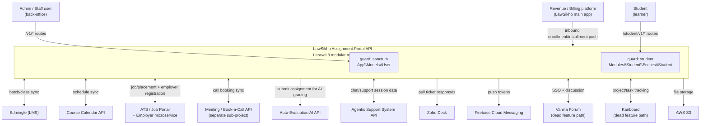
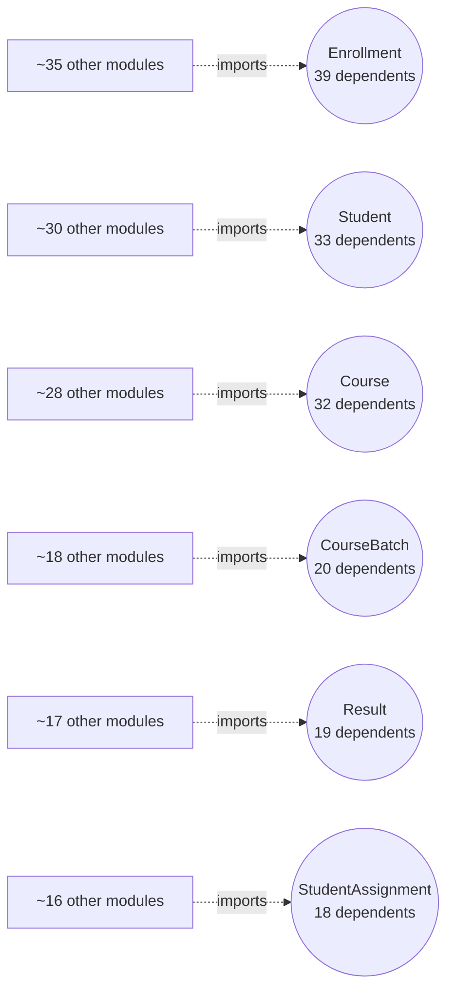
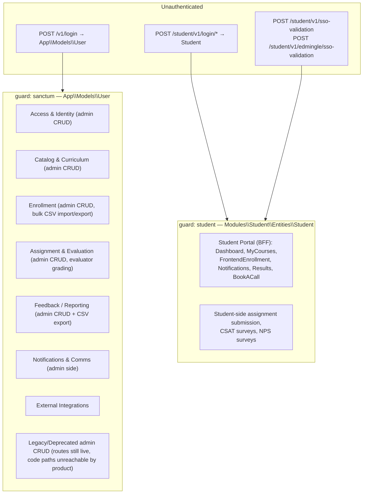

# LawSikho Assignment Portal API — Context Map

> **Generated:** 2026-08-29
> **Branch surveyed:** `New-Dummy-Prod-0605`
> **Method:** Derived from the code itself — `use Modules\X` import statements across all 62 `Modules/*` directories (377 unique cross-module edges), `module.json` (`requires` is `[]` in every module — there is no declared dependency graph, so the edges below are the *only* real dependency graph that exists), `config/auth.php` guards, and cross-checked against `documentation/DEVELOPER_DOCUMENTATION.md`, `USER_WORKFLOWS.md`, `BUSINESS_RULES.md`, and `DATABASE_SCHEMA.md`.

## Why this document exists and how to use it

The other docs in this folder answer "what does endpoint X do" (`API_SPECIFICATIONS.md`), "what does the schema look like" (`DATABASE_SCHEMA.md`), "what business rule governs Y" (`BUSINESS_RULES.md`), and "what does a real user do end-to-end" (`USER_WORKFLOWS.md`). None of them answer **"how do the 62 modules actually relate to each other, and what breaks if I touch one of them?"** — that's what this document is for.

Root-level `*.md` files (e.g. `AI_EVALUATION_TASK_BREAKDOWN.md`, `ENROLLMENT_LIMIT_IMPACT_ANALYSIS.md`) are point-in-time task write-ups, not living architecture docs — do not treat them as current. This file, like its siblings in `documentation/`, is a snapshot re-derived from code; re-verify before relying on it for anything load-bearing (e.g. deciding a module is safe to delete).

**Use this doc to:** pick the right module before you start a change, understand blast radius before deleting/refactoring a module, and see which "deprecated" modules are still structurally load-bearing even though the feature itself is off.

---

## 1. System context

Two independent identities exist side by side in one codebase: **Admin/Staff** (`App\Models\User`, guard `sanctum`) and **Student** (`Modules\Student\Entities\Student`, guard `student`). They never share a guard, but they share almost everything else — see §4.

---

## 2. Architectural style: shared-kernel monolith, not isolated bounded contexts

`nwidart/laravel-modules` gives every module its own `module.json` with a `requires` array meant to declare inter-module dependencies. **In this codebase that array is empty (`"requires": []`) in every module checked** — the module boundary is a *folder/namespace* convention, not an enforced dependency boundary. Nothing stops (and in practice nothing has stopped) any module from directly importing another module's Eloquent entities, traits, or jobs.

The result, measured directly from `use Modules\X` imports (377 edges across 62 modules): the domain groupings in §3 form a **near-complete mesh** at the group level — almost every group imports from almost every other group. This is a legitimate architectural fact worth stating plainly: **there are no clean bounded contexts here**. The groupings below are an organizational/documentation aid to help you find things, not an enforced isolation boundary. Treat any assumption like "I can safely change Module X without touching Module Y" as something to verify with a grep, never something to infer from the module folder structure alone.

---

## 3. Domain groupings (62 modules → 11 groups)

| Group | Modules | Status |
|---|---|---|
| **Access & Identity** | Auth, StudentAuth, User, Role, Permission, JobRole | Live |
| **Student Core & Profile** | Student, StudentProfile, StudentDegree, StudentUniversity, ReferralSystem, InternalNotes | Live |
| **Catalog & Curriculum** | Course, CourseBatch, CourseCategory, CourseCategoryCriteria, CourseCriteria, CourseFaq, CoursePlanType, CourseCompletionMaster, Topic, Package, Bootcamp, Evaluator | Live |
| **Enrollment (core hub)** | Enrollment, RevenueAPI | Live |
| **Assignment & Evaluation** | Assignment, AssignmentTag, AssignmentSendingLog, StudentAssignment, Result, AIEvaluation | Live |
| **Feedback (CSAT/NPS)** | AssignmentCSAT, EvaluatorCSAT, NPS | Live |
| **Student Portal (BFF layer)** | StudentDashboard, StudentDashboardManagement, StudentMyCourses, StudentFrontendEnrollment, StudentNotifications, StudentResults, StudentBookACall | Live |
| **Notifications & Comms** | Notification, EmailTemplate, Webhook | Live |
| **External Integrations** | AtsAPI, AgenticSupportSystem, LawSikho | Live |
| **Legacy/Deprecated cluster** | Class, ClassCSAT, StudentClasses, PerformanceCoach, PerformanceCoachCSAT, StudentPerformanceCoach, Forum, StudentForum, ProjectManagement, StudentTasks, BookMaster, BookDeliveryLog | ⚠️ Confirmed not in active use (team, 2026-08-29) — see `documentation/USER_WORKFLOWS.md` and memory `deprecated-modules` |
| **Reference Data** | Country, State | Live (static master data) |

`StudentBookACall` sits in the live "Student Portal" group deliberately — despite living next to the dead `PerformanceCoach`/`StudentPerformanceCoach` pair alphabetically and thematically, it is confirmed live and talks to a genuinely different external sub-project (its own API, via `MEETING_API_BASE_URL`/`BOOK_A_CALL_API`), not the coaching feature.

Per-module one-line purposes are already maintained in `documentation/DEVELOPER_DOCUMENTATION.md` §4 — this doc doesn't repeat them, it adds the *relationship* layer on top.

---

## 4. The shared kernel: modules everything depends on

Six modules are structurally central — a large fraction of the other 56 modules import their entities directly. These are the modules where a schema change or entity refactor has the widest blast radius in the codebase:

| Module | Modules that depend on it (in-degree) | Modules it depends on (out-degree) |
|---|---|---|
| **Enrollment** | 39 | 22 |
| **Student** | 33 | 25 |
| **Course** | 32 | 18 |
| **CourseBatch** | 20 | 11 |
| **Result** | 19 | 12 |
| **StudentAssignment** | 18 | 15 |

Practical implication: `Enrollment`, `Student`, and `Course` function as the de facto **shared kernel** of the whole system. Any migration touching their core tables (`enrollments`, `students`, `courses`) should be assumed to ripple through most of the other 11 domain groups — this matches the "God module" pattern already flagged for `Enrollment` and `Student` in `documentation/DATABASE_SCHEMA.md`.

Two modules are notable for the *opposite* reason — huge fan-**out**, tiny fan-in — meaning they're aggregation/BFF layers built on top of the kernel rather than kernel members themselves:

| Module | In-degree | Out-degree | Read as |
|---|---|---|---|
| **StudentFrontendEnrollment** | 2 | 25 | Student-facing aggregation layer that re-exposes CSAT/NPS/Notification/Task/Filter functionality from other modules — confirm with the team whether this duplication is intentional (also flagged in `DEVELOPER_DOCUMENTATION.md` §4) |
| **AgenticSupportSystem** | 0 | 17 | Pure consumer — reads across Assignment/Course/Enrollment/Student data to answer an external AI support system, contributes nothing back |
| **StudentDashboard** | 4 | 17 | Dashboard aggregation layer, same BFF pattern |
| **StudentMyCourses** | 5 | 16 | Same pattern |

---

## 5. Deprecated cluster is not actually isolated — do not delete-by-folder

The 12 modules in the Legacy/Deprecated cluster (§3) are confirmed off the live product surface, but **live, actively-used modules still import their entities directly** — this was verified with concrete `use` statements, not just the aggregate edge count:

| Live module (in production) | Imports from deprecated module | Evidence |
|---|---|---|
| `Student` (the core model) | `ClassParticipants`, `ClassCSATForm` | `Modules/Student/Entities/Student.php:26-27` |
| `Student` | `PerformanceCoachCallSchedule`, `PerformanceCoachStartAndPause`, `PerformanceCoachStudentReport`, `PerformanceCoachStudents` | `Modules/Student/Entities/Student.php:37-40` |
| `Student` | `ProjectTaskStudentFiles` | `Modules/Student/Entities/Student.php:41` |
| `Student` | `BookDeliveryLog` | `Modules/Student/Entities/Student.php:24` |
| `Student` | `PerformanceCoachRange` | `Modules/Student/Entities/StudentWeekDayAvailability.php:9` |
| `Student` | `kanboardTrait` (ProjectManagement) | `Modules/Student/Http/Traits/StudentTrait.php:28` |
| `Enrollment` (the core model) | `Book` (BookMaster) | `Modules/Enrollment/Entities/Enrollment.php:21` |
| `Enrollment` | `Project`, `kanboardTrait` (ProjectManagement) | `Modules/Enrollment/Imports/EnrollmentImport.php:21-22`, `Modules/Enrollment/Http/Traits/EnrollmentTrait.php:51`, `Modules/Enrollment/Jobs/EnrollmentCsvImport.php:19` |
| `CourseBatch` | `ClassCourseBatch` (Class) | `Modules/CourseBatch/Entities/CourseBatch.php:13` |

The most load-bearing case: **`Student.php` and `Enrollment.php` — the two most central models in the entire system — declare Eloquent relationships directly into 5 of the 12 "dead" modules.** Deleting or archiving any of those 12 modules by simply removing their `Modules/<Name>` folder will break the core `Student`/`Enrollment` models' class loading, even though no live route exercises the *feature*. Treat "deprecated" here as **"the feature is off," not "the code is disconnected."** Before archiving any module in this cluster, grep the rest of the codebase (not just its own folder) for `Modules\<Name>\`.

This table is not exhaustive — it's confirmatory evidence for the aggregate finding from §2/§4's edge data (the full 377-edge list underlying this document lists every such import); re-grep before acting on any specific module.

---

## 6. Auth/guard boundary

Neither guard is aware of the other — there is no single "user" abstraction spanning admin and student; they are two entirely separate Eloquent models (`App\Models\User` vs `Modules\Student\Entities\Student`) with two separate Sanctum token spaces. `spatie/laravel-permission` (RBAC) is wired only to the admin side (`Role`/`Permission` modules); the student guard has no role/permission layer. Full guard/route detail: `documentation/DEVELOPER_DOCUMENTATION.md` §5–6.

`tymon/jwt-auth` is an installed-but-unused dependency (no `Tymon\JWTAuth` usage anywhere in application code) — don't assume JWT plays any role in this boundary; Edmingle SSO goes through the `student` Sanctum guard, same as normal student login.

---

## 7. External system context (who calls whom)

| External system | Direction | Owning module(s) | Notes |
|---|---|---|---|
| Edmingle (LMS) | Outbound (this API → Edmingle) | `Enrollment` (`CreateEdmingleBatch`, `RetryEdmingleAssignmentJob`), `Student` (`Activate/DeactivateStudentEdmingleBatches`), `Auth` (`SyncUserWithLMS`) | Credential env vars not clearly named `EDMINGLE_*` — likely proxied via `COURSE_CALENDAR_API_URL` config; unresolved ambiguity carried over from `DEVELOPER_DOCUMENTATION.md` §14 |
| Course Calendar API | Bidirectional | `Enrollment`, `CourseBatch` | `COURSE_CALENDAR_API_URL` (note: `.env` key is misspelled `COURSE_CALENDER_API_URL`) |
| ATS / Job Portal + Employer microservice | Outbound | `AtsAPI`, `User` (`SendUserDetailsToExternalApi`) | Two-step chain: register on job-portal API, then create employer record on a separate microservice — see `BUSINESS_RULES.md` §6 |
| Revenue/Billing platform | **Inbound** (external system pushes into this API) | `RevenueAPI` → writes into `Enrollment` | The only major integration where this API is the *receiver*, not the initiator |
| Meeting/Book-a-Call API | Bidirectional | `StudentBookACall` | A genuinely separate sub-project's own API, not a third party |
| Auto-Evaluation AI API | Outbound | `AIEvaluation` | Submits student assignment text for AI grading, receives results via webhook |
| Agentic Support System API | Bidirectional | `AgenticSupportSystem` | Static-token-authenticated (`X-API-Token`), not Sanctum |
| Zoho Desk | Outbound (pull) | `Enrollment` (`SyncZohoSupportResponses` console command) | Support ticket data pulled into enrollment records |
| Firebase Cloud Messaging | Outbound | `User`, `Student` | Push tokens |
| Vanilla Forum | Bidirectional | `Forum`, `StudentForum` | ⚠️ Part of the deprecated cluster — dead in product terms even though the integration code exists |
| Kanboard | Bidirectional | `ProjectManagement` | ⚠️ Part of the deprecated cluster, but see §5 — `kanboardTrait` is still imported by live `Student`/`Enrollment` code |
| AWS S3 | Outbound | Global (`config/filesystems.php`) | File storage for assignments, CSVs, media |

Full integration detail (env var names, file locations): `documentation/DEVELOPER_DOCUMENTATION.md` §14.

---

## 8. Where each kind of change should make you nervous

A rough triage, derived from the coupling data above — use it as a first pass, not a substitute for grepping the actual change:

| If you're changing... | Blast radius | Why |
|---|---|---|
| `Enrollment`, `Student`, or `Course` entity/schema | System-wide | Shared kernel — 30+ dependent modules each (§4) |
| `CourseBatch` or `Result` | Large | 19–20 dependents, deeply wired into the assignment/evaluation and batch-sync flows |
| Anything in the Legacy/Deprecated cluster | Deceptively non-zero | Feature is off, but live `Student`/`Enrollment` models still declare relationships into it (§5) — don't delete-by-folder |
| `StudentFrontendEnrollment`, `StudentDashboard`, `StudentMyCourses`, `AgenticSupportSystem` | Contained | High fan-out, near-zero fan-in — these are leaf/aggregator consumers, safe to refactor internally without touching other modules |
| `AssignmentTag`, `Auth`, `Country`, `CoursePlanType`, `InternalNotes`, `JobRole`, `State` | Minimal | Zero or near-zero outgoing cross-module coupling (§9) — genuinely self-contained |

---

## 9. Appendix: full module coupling table (all 62)

`In` = number of distinct other modules that import this module's classes. `Out` = number of distinct other modules this module imports from. Sorted by total coupling (`In + Out`).

| Module | In | Out | | Module | In | Out |
|---|---|---|---|---|---|---|
| Enrollment | 39 | 22 | | AssignmentTag | 9 | 0 |
| Student | 33 | 25 | | BookDeliveryLog | 5 | 4 |
| Course | 32 | 18 | | PerformanceCoach | 4 | 5 |
| StudentAssignment | 18 | 15 | | StudentBookACall | 2 | 7 |
| CourseBatch | 20 | 11 | | AssignmentSendingLog | 4 | 4 |
| Result | 19 | 12 | | ClassCSAT | 4 | 4 |
| StudentFrontendEnrollment | 2 | 25 | | Role | 4 | 4 |
| Assignment | 15 | 11 | | CourseCriteria | 5 | 2 |
| Package | 15 | 8 | | EvaluatorCSAT | 4 | 3 |
| StudentDashboard | 4 | 17 | | AIEvaluation | 3 | 3 |
| StudentMyCourses | 5 | 16 | | Country | 6 | 0 |
| StudentDashboardManagement | 6 | 14 | | CourseCategoryCriteria | 5 | 1 |
| Class | 12 | 6 | | StudentClasses | 0 | 6 |
| AgenticSupportSystem | 0 | 17 | | EmailTemplate | 2 | 3 |
| AssignmentCSAT | 9 | 8 | | PerformanceCoachCSAT | 2 | 2 |
| CourseCompletionMaster | 7 | 9 | | StudentPerformanceCoach | 1 | 3 |
| CourseCategory | 7 | 7 | | AtsAPI | 1 | 2 |
| NPS | 7 | 7 | | CourseFaq | 2 | 1 |
| Notification | 7 | 6 | | StudentResults | 0 | 3 |
| User | 8 | 5 | | StudentTasks | 0 | 3 |
| ProjectManagement | 7 | 5 | | Auth | 2 | 0 |
| Topic | 8 | 4 | | Evaluator | 0 | 2 |
| Webhook | 11 | 1 | | Forum | 1 | 1 |
| LawSikho | 1 | 10 | | Permission | 1 | 1 |
| StudentNotifications | 0 | 11 | | ReferralSystem | 0 | 2 |
| BookMaster | 4 | 6 | | RevenueAPI | 0 | 2 |
| Bootcamp | 7 | 3 | | StudentAuth | 0 | 2 |
| StudentProfile | 5 | 5 | | JobRole | 1 | 0 |
| | | | | State | 1 | 0 |
| | | | | StudentDegree | 0 | 1 |
| | | | | StudentForum | 0 | 1 |
| | | | | StudentUniversity | 0 | 1 |
| | | | | CoursePlanType | 0 | 0 |
| | | | | InternalNotes | 0 | 0 |

`CoursePlanType` and `InternalNotes` are the only two modules with zero cross-module coupling in either direction — fully self-contained.

---

## 10. Related documents

- `documentation/BOUNDED_CONTEXT_{IDENTITY,LEARNING,ENROLLMENT,ASSESSMENT,COMMUNICATION,INTEGRATIONS}.md` — a deeper, 6-context cut of the same 62 modules (a different partition than the 11 groups in §3 above, optimized for business-capability ownership rather than code proximity), with per-context internal coupling diagrams and inter-context relationship tables
- `documentation/DOMAIN_MODEL_DIAGRAM.md` — the table-level (data) counterpart to this document's module-level (code) coupling map, as ER diagrams per bounded context
- `documentation/EVENT_LIST.md` — every Laravel Event, business webhook-event, and job-dispatch trigger, with each one verified live or dead (most of the formal event/webhook layer turns out to be disabled code)
- `documentation/EVENT_CATALOG.md` — a structured, per-event reference (producer/consumer/payload/status) built on the same research as `EVENT_LIST.md`
- `documentation/SERVICE_BOUNDARIES.md` — the real external service/database boundaries this app crosses, plus a service-extraction-readiness assessment per bounded context built on this document's coupling numbers
- `documentation/DEVELOPER_DOCUMENTATION.md` — tech stack, per-module purpose, full route reference, middleware, jobs, integrations, env vars
- `documentation/DATABASE_SCHEMA.md` — table-level schema and FK relationships (the data-layer counterpart to this module-coupling map)
- `documentation/BUSINESS_RULES.md` — the "why" behind specific validation/workflow logic
- `documentation/USER_WORKFLOWS.md` — real end-to-end flows traced through the modules mapped here, plus a QA-test-design cross-cutting-findings section
- Memory `deprecated-modules` / `user-testing-python-qa-project` — team-confirmed live/dead status behind §3 and §5, kept in the assistant's persistent memory for this project
