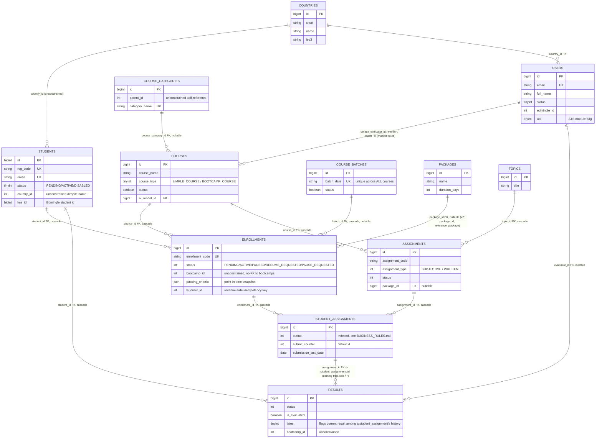
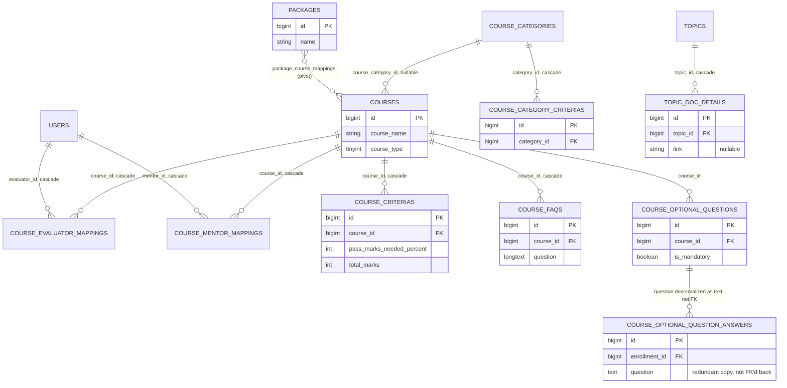
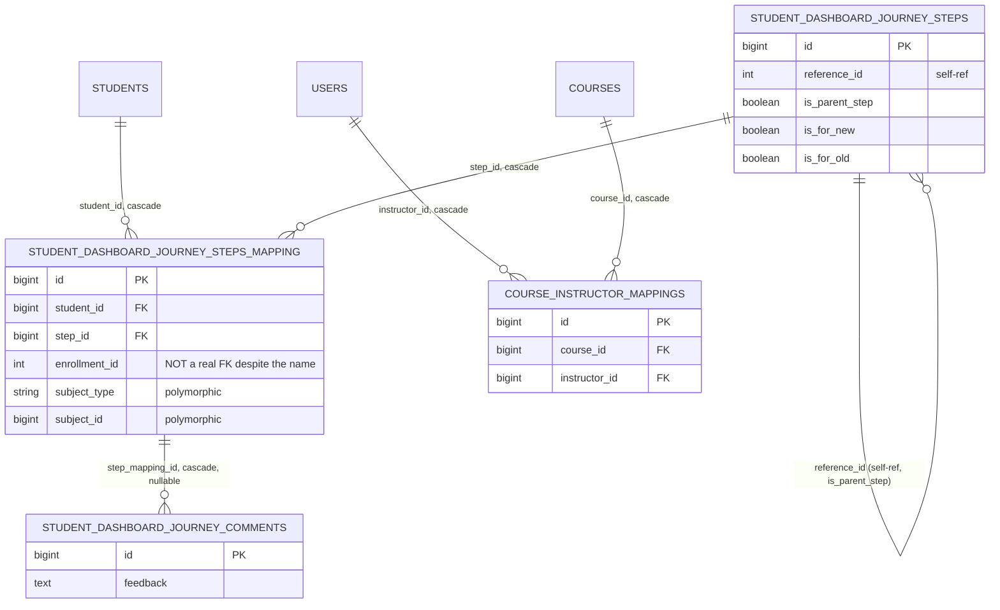
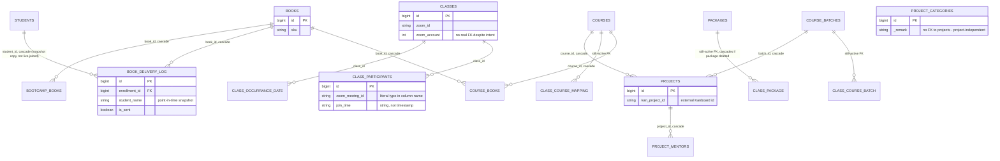
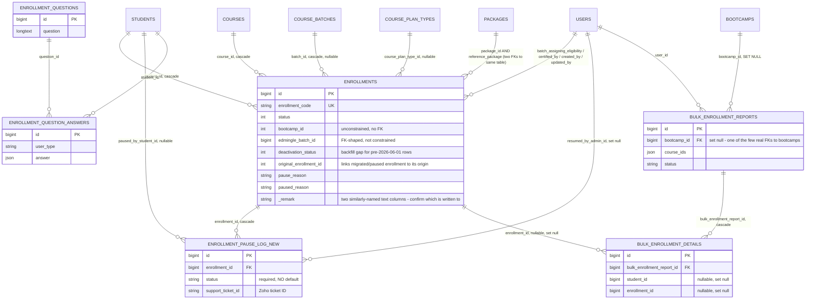
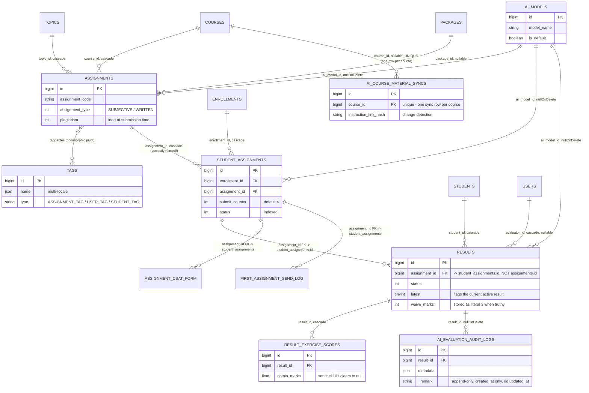
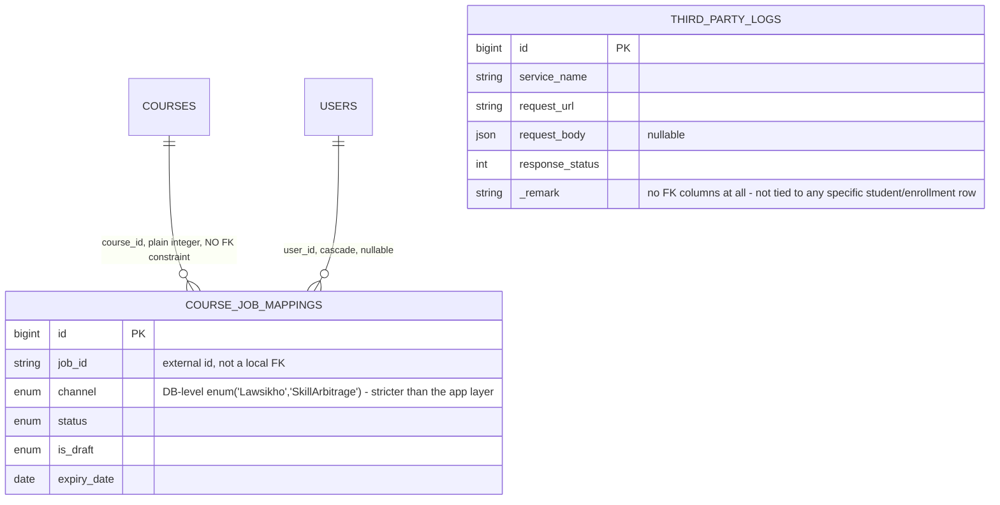

# Domain Model Diagram

> **Generated:** 2026-08-29 · **Branch surveyed:** `New-Dummy-Prod-0605`
> **Source of truth:** traced from actual migration files (create + every subsequent alter) and Eloquent entity relationships — cross-checked against `documentation/DATABASE_SCHEMA.md` (the full column-level reference this document diagrams). Where the two disagree, trust `DATABASE_SCHEMA.md`; this doc is a visual distillation of it, not an independent source.
> **Companion documents:** `documentation/CONTEXT_MAP.md` (module coupling), `documentation/BOUNDED_CONTEXT_{IDENTITY,LEARNING,ENROLLMENT,ASSESSMENT,COMMUNICATION,INTEGRATIONS}.md` (business-capability ownership), `documentation/DATABASE_SCHEMA.md` (full column listing per table)

## How to read these diagrams

Diagrams use Mermaid `erDiagram` notation, one section per bounded context (same 6-context split as the `BOUNDED_CONTEXT_*.md` docs) plus one system-wide overview. Entities show **only the columns that matter for understanding the shape of the model** — PKs, FKs, and the handful of business-critical attributes — not the full column list (that's `DATABASE_SCHEMA.md`'s job).

- `PK` = primary key
- `FK` = a real, DB-enforced foreign key (`ON DELETE CASCADE`/`SET NULL` as noted in prose)
- A plain quoted comment with no `FK`/`PK` tag on an id-shaped column means **it looks like a foreign key but has no DB-level constraint** — the referential integrity, if any, is enforced only in application code, not the database. This codebase has an unusually high number of these; each one is a real place where an orphaned or garbage value can exist in the database undetected. They're marked deliberately, not omitted, because "the domain model as it actually is" includes where it's weaker than it looks.
- `||--o{` reads "one required, related to zero-or-many" (a standard 1:N with the child FK nullable-in-practice or not depending on the FK's own nullability, noted in prose). `}o--o{` marks a genuine pivot-backed many-to-many, shown via the pivot table as its own entity rather than a direct line, because that's what actually exists in the schema.

---

## 1. System-wide core domain model

The backbone that every bounded context ultimately connects through:

**Immediately visible structural fact:** `course_batches` has **no `course_id` column at all** — a batch is a global, date-keyed cohort concept, not intrinsically owned by one course at the DB level. The course↔batch association only exists per-enrollment (`enrollments` carries both `course_id` and `batch_id` independently) or via the separate `edmingle_batches` table (which does carry both). Don't draw — or assume the code enforces — a direct `Course 1—N Batch` relationship; it isn't there.

**Second structural fact:** `bootcamps` has no DB relationship to `courses` at all. `enrollments.bootcamp_id` is a plain unconstrained integer, and `bootcamp_books` links bootcamps to `books` (deprecated), not to courses. A "bootcamp" and its associated "bootcamp course" are two independently-tracked concepts joined only in application logic, if at all — see `BOUNDED_CONTEXT_LEARNING.md` §3 for the same finding from the code side.

---

## 2. Identity context

```mermaid
erDiagram
    USERS ||--o{ USER_DETAILS : "user_id FK"
    USERS ||--o{ USER_JOB_ROLE_MAPPINGS : "user_id FK, cascade"
    JOB_ROLES ||--o{ USER_JOB_ROLE_MAPPINGS : "job_role_id FK, cascade"
    USERS ||--o{ USERS : "created_by / updated_by (self-FK)"
    STUDENTS ||--o{ STUDENT_OTHER_DETAILS : "student_id FK"
    STUDENTS ||--o{ STUDENT_ORIGINAL_REGISTRATION_DETAILS : "student_id FK, nullable"
    STUDENTS ||--o{ STUDENTS_INTERNAL_NOTES : "student_id FK, cascade"
    STUDENTS_INTERNAL_NOTES ||--o{ INTERNAL_NOTES_HISTORY : "history_tab_id (no DB FK, app-level only)"
    STUDENTS ||--o{ STUDENT_WEEK_DAY_AVAILABILITIES : "student_id FK, cascade"
    COUNTRIES ||--o{ STATES : "country_id FK, cascade"
    KNOW_ABOUT_LAWSIKHO_QUESTION ||--o{ KNOW_ABOUT_LAWSIKHO_STUDENT_ANSWER : "answer_id FK"
    STUDENTS ||--o{ KNOW_ABOUT_LAWSIKHO_STUDENT_ANSWER : "student_id FK"
    ROLES }o--o{ PERMISSIONS : "role_has_permissions (pivot)"
    ROLES ||--o{ MODEL_HAS_ROLES : "polymorphic model_type/model_id"
    PERMISSIONS ||--o{ MODEL_HAS_PERMISSIONS : "polymorphic model_type/model_id"

    USER_DETAILS {
        bigint id PK
        bigint user_id FK
        string third_party_id "nullable"
    }
    JOB_ROLES {
        bigint id PK
        string title
    }
    STUDENT_OTHER_DETAILS {
        bigint id PK
        bigint student_id FK
    }
    STUDENT_ORIGINAL_REGISTRATION_DETAILS {
        bigint id PK
        text original_registration_details_json
    }
    STUDENTS_INTERNAL_NOTES {
        bigint id PK
        bigint student_id FK
        text notes
        boolean is_edited
    }
    INTERNAL_NOTES_HISTORY {
        bigint id PK
        int internal_note_id "no DB FK, immutable append-only"
        text notes
    }
    STUDENT_WEEK_DAY_AVAILABILITIES {
        bigint id PK
        bigint student_id FK
        bigint range_id "FK -> performance_coach_ranges.id (deprecated module!)"
        bigint weekday_id FK
    }
    STATES {
        bigint id PK
        string name
        bigint country_id FK
    }
    KNOW_ABOUT_LAWSIKHO_QUESTION {
        bigint id PK
        string question
    }
    KNOW_ABOUT_LAWSIKHO_STUDENT_ANSWER {
        bigint id PK
        bigint student_id FK
        bigint answer_id FK
    }
    ROLES {
        bigint id PK
        string name
        string guard_name
    }
    PERMISSIONS {
        bigint id PK
        int parent_id "self-ref, unconstrained"
        string name
    }
```

**Notable anomaly worth flagging in the domain model itself:** `student_week_day_availabilities` — a **live, Identity-context table** — has a real, DB-enforced foreign key into `performance_coach_ranges`, a table owned entirely by the deprecated `PerformanceCoach` module. This is the schema-level twin of the code-level finding in `BOUNDED_CONTEXT_IDENTITY.md`/`CONTEXT_MAP.md` §5: the live/deprecated boundary is not clean, at either the code layer or the data layer.

`students.country_id` has no DB FK despite the name (added later, 2023-06-27, as a plain integer) — don't assume referential integrity here even though `countries.id: 99` is hardcoded app-wide to mean India.

---

## 3. Learning context

Split into the same three sub-clusters as `BOUNDED_CONTEXT_LEARNING.md` — core catalog is the load-bearing part; the deprecated cluster is shown separately because it's genuinely a different reliability tier.

### 3a. Core catalog — live

Two identically-shaped "criteria" tables exist (`course_criterias`, `course_category_criterias`) — only `course_criterias` is confirmed live at completion-check time (`USER_WORKFLOWS.md` §2.3); treat `course_category_criterias` as a secondary/legacy source unless told otherwise.

### 3b. Student journey / BFF layer — live

`StudentBookACall`'s actual booking/meeting records are **not stored locally at all** — they live entirely in the external sub-project behind `MEETING_API_BASE_URL`/`BOOK_A_CALL_API`. `course_instructor_mappings` is the only local table this feature owns.

### 3c. Deprecated delivery/support cluster — confirmed not in active use

Even though the *features* are dead, several of these tables carry **live, still-enforced** foreign keys into active tables (`packages`, `courses`, `course_batches`) — deleting a package or course row would cascade-delete rows in `class_package`/`class_course_mapping` even though nothing reads them. This is the DB-level version of the "deprecated but not disconnected" finding — see `CONTEXT_MAP.md` §5 and `BOUNDED_CONTEXT_LEARNING.md` §6 for the code-level counterpart.

---

## 4. Enrollment context

`enrollments.bootcamp_id` (the field you'd expect to link to a bootcamp) is **unconstrained**, while `bulk_enrollment_reports.bootcamp_id` **is** a real, DB-enforced FK — an inconsistency worth knowing before assuming either field behaves like the other. `RevenueAPI` and `ReferralSystem` (both part of this context per `BOUNDED_CONTEXT_ENROLLMENT.md`) own no tables of their own — confirmed entity-less; their writes land on `enrollments`/`students` columns already shown above.

---

## 5. Assessment context

**The single most important structural fact in the whole domain model:** every `assignment_id` column in this diagram except `student_assignments.assignment_id` itself and `assignment_log_mapping.assignment_id` actually **foreign-keys to `student_assignments.id`, not `assignments.id`**, despite the column name in every case. This is systemic, not a one-off typo — `results`, `assignment_csat_form`, `first_assignment_send_log`, `course_featured_assignment_mapping`, `student_result_video_mapping`, and `student_assignment_video_mapping` (Learning context) all follow this pattern. Anyone writing raw SQL, seeding fixtures, or building an external QA harness against this schema needs to know this before writing a single join.

---

## 6. Communication context

```mermaid
erDiagram
    NOTIFICATION_CATEGORY ||--o{ NOTIFICATION : "category_id"
    NOTIFICATION ||--o{ BATCH_NOTIFICATION : "notification_id, cascade"
    COURSE_BATCHES ||--o{ BATCH_NOTIFICATION : "cascade"
    NOTIFICATION ||--o{ COURSE_NOTIFICATION : "notification_id, cascade"
    COURSES ||--o{ COURSE_NOTIFICATION : "cascade"
    NOTIFICATION ||--o{ PACKAGE_NOTIFICATION : "notification_id, cascade"
    PACKAGES ||--o{ PACKAGE_NOTIFICATION : "cascade"
    NOTIFICATION ||--o{ NOTIFICATION_USER : "notification_id, cascade"
    STUDENTS ||--o{ NOTIFICATION_USER : "column literally named user_id, FK's to students.id"
    NOTIFICATION ||--o{ NOTIFICATION_COMMENTS : "notification_id"
    WEBHOOK_EVENTS ||--o{ WEBHOOKS : "event_id, NOT NULL at DB level"
    WEBHOOKS ||--o{ WEBHOOK_LOGS : "webhook_id, cascade"
    STUDENTS ||--o{ ASSIGNMENT_CSAT_FORM : "student_id"
    STUDENTS ||--o{ EVALUATOR_CSAT_FORM : "student_id"
    RESULTS ||--o{ EVALUATOR_CSAT_FORM : "result_id"
    USERS ||--o{ EVALUATOR_CSAT_FORM : "evaluator_id"
    STUDENTS ||--o{ NPS_FORM : "student_id, REQUIRED"
    ENROLLMENTS ||--o{ NPS_FORM : "enrollment_id, REQUIRED"
    STUDENTS ||--o{ NPS_FORM_V2 : "student_id ONLY - no enrollment/course/batch FK"
    NPS_FORM_REASON ||--o{ NPS_FORM_REASON_MAPING : "reason_id"
    NPS_FORM_REASON ||--o{ NPS_FORM_REASON_MAPPING_V2 : "reason_id, plus reason_parent_id for 2-level hierarchy"

    NOTIFICATION {
        bigint id PK
        string title
        datetime sent_at "widened from date via separate alter"
        int status "0=pending,1=sent"
    }
    NOTIFICATION_USER {
        bigint id PK
        bigint user_id "misleading name, actually students.id"
        timestamp read_at
    }
    NOTIFICATION_COMMENTS {
        bigint id PK
        int parent_id "unconstrained, threaded"
        int created_by "either users.id or students.id depending on user_type enum"
    }
    WEBHOOKS {
        bigint id PK
        string webhook_secret
        int failure_count
        string _remark "two identical CREATE migrations exist - see DATABASE_SCHEMA.md §1"
    }
    WEBHOOK_LOGS {
        bigint id PK
        bigint webhook_id FK
        string status_code "string, not integer"
        json payload "required, no live writer observed"
    }
    NPS_FORM {
        bigint id PK
        bigint student_id FK
        bigint enrollment_id FK
        string survey_type "default SURVEY_TYPE_1"
    }
    NPS_FORM_V2 {
        bigint id PK
        bigint student_id FK
        string survey_type "required, NO default"
        text experience "text not string - longer answers"
    }
    NPS_FORM_REASON {
        bigint id PK
        string question
        int parent_id "unconstrained"
    }
    ASSIGNMENT_CSAT_FORM {
        bigint id PK
        bigint assignment_id "FK -> student_assignments, not assignments"
        int rating
    }
    EVALUATOR_CSAT_FORM {
        bigint id PK
        bigint result_id FK
        bigint evaluator_id FK
    }
```

Two structurally unrelated tables share near-identical names: **`notification`** (this module's custom entity, singular) vs. **`notifications`** (Laravel's own built-in queued-notification table, plural, UUID PK, unrelated data model). Don't confuse them when writing queries or fixtures. `nps_form` (v1) and `nps_form_v2` are genuinely different schemas, not a superset relationship — v2 dropped the enrollment/course/batch FKs entirely and widened text fields; v1 is not deprecated by v2's existence, both may need independent test coverage. `class_csat_form`/`_reason`/`_reason_maping` and `performance_coach_csat_form`/`_reason`/`_reason_mapping` (both deprecated, tied to Learning's dead `Class`/`PerformanceCoach` modules) follow the same three-table shape as `assignment_csat_form` and `evaluator_csat_form` above but are omitted from this diagram — see `DATABASE_SCHEMA.md` §3/§5 for their columns if needed.

---

## 7. Integrations context

This is by far the smallest schema footprint of the 6 contexts — consistent with the coupling finding in `BOUNDED_CONTEXT_INTEGRATIONS.md` that this context is an outbound-facing gateway layer, not a data owner. `AgenticSupportSystem` owns **no local tables at all** — it reads across every other context's tables live rather than maintaining its own copy. `third_party_logs` is what actually backs `LawSikho`'s near-universal request logging, including on unauthenticated endpoints, per `API_SPECIFICATIONS.md`.

---

## 8. Domain-model anomalies worth designing around

Collected here because they're properties of the model itself, not any one context — a QA harness, a new feature, or a migration plan needs to account for all of them regardless of which context it touches:

| Anomaly | Where | Why it matters |
|---|---|---|
| **Systemic `assignment_id` naming trap** | `results`, `assignment_csat_form`, `first_assignment_send_log`, `course_featured_assignment_mapping`, `student_result_video_mapping`, `student_assignment_video_mapping` | Every one of these FKs to `student_assignments.id`, not `assignments.id`, despite the column name. Only `student_assignments.assignment_id` and `assignment_log_mapping.assignment_id` point at the real `assignments` table |
| **`course_batches` has no `course_id`** | Learning §3a | A batch is not intrinsically course-scoped at the DB level; the association only exists via `enrollments` or `edmingle_batches` |
| **`bootcamps` has no DB relationship to `courses`** | System overview §1 | "Bootcamp" and "bootcamp course" are independently tracked; `enrollments.bootcamp_id` is unconstrained |
| **Two identical `webhooks` CREATE migrations** | Communication §6 | Confirm which is authoritative before trusting the schema for this table |
| **Two similarly-named enrollment pause columns** (`pause_reason`, `paused_reason`) | Enrollment §4 | Confirm which one the app actually writes to before asserting on either |
| **Dual OTP mechanism on `students`** (`verification_otp` vs. `otp`/`otp_expire_at`, added 8 months apart) | Identity | Two independent OTP systems coexist — see `DATABASE_SCHEMA.md` §1 |
| **`notification` vs. `notifications`** | Communication §6 | Two unrelated tables with near-identical names and different owners (custom module vs. Laravel core) |
| **NPS v1/v2 are different schemas, not a migration path** | Communication §6 | v2 dropped enrollment/course/batch FKs and widened text fields; both may be independently live |
| **`student_week_day_availabilities.range_id` FKs into a deprecated module's table** | Identity §2 | A live Identity table has a hard, DB-enforced dependency on `performance_coach_ranges` |
| **Deprecated-cluster tables retain live FKs into active tables** (`class_package` → `packages`, `class_course_mapping` → `courses`, `class_course_batch` → `course_batches`) | Learning §3c | Deleting a live package/course/batch row cascades into dead-feature tables that nothing reads |
| **A large number of FK-shaped, DB-unconstrained columns** (`students.country_id`, `enrollments.bootcamp_id`, `enrollments.edmingle_batch_id`, `results.bootcamp_id`, `course_job_mappings.course_id`, `student_dashboard_journey_steps_mapping.enrollment_id`, and others) | Throughout | The database will not catch an orphaned reference in any of these; application-level validation is the only guard, if one exists at all |

## 9. Related documents

- `documentation/DATABASE_SCHEMA.md` — the full column-level reference this document diagrams; consult it for exact types, defaults, and nullability
- `documentation/CONTEXT_MAP.md` — module-level (code) coupling, the counterpart to this document's table-level (data) coupling
- `documentation/BOUNDED_CONTEXT_{IDENTITY,LEARNING,ENROLLMENT,ASSESSMENT,COMMUNICATION,INTEGRATIONS}.md` — business-capability ownership and module relationships per context
- `documentation/BUSINESS_RULES.md` / `USER_WORKFLOWS.md` — the behavioral rules and end-to-end flows that operate on this data model
